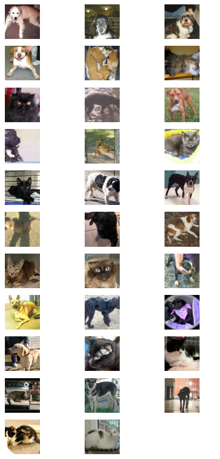
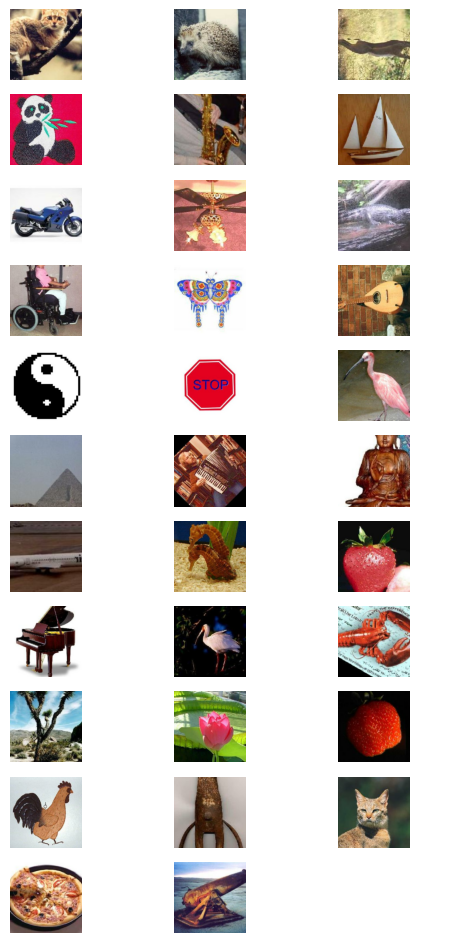
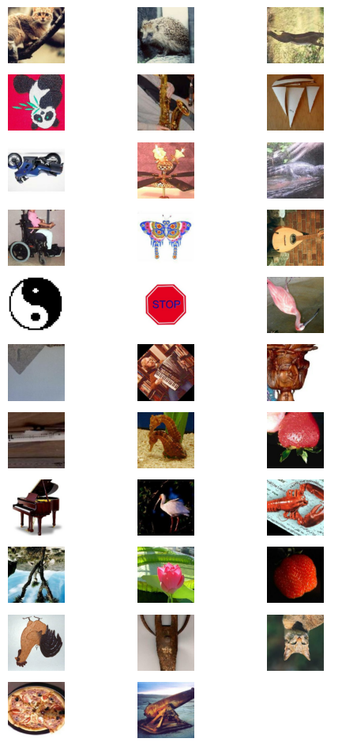
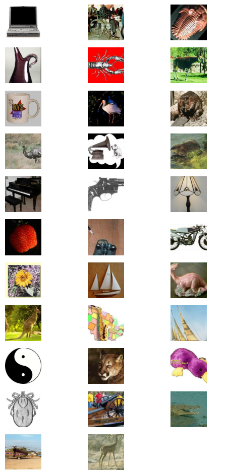
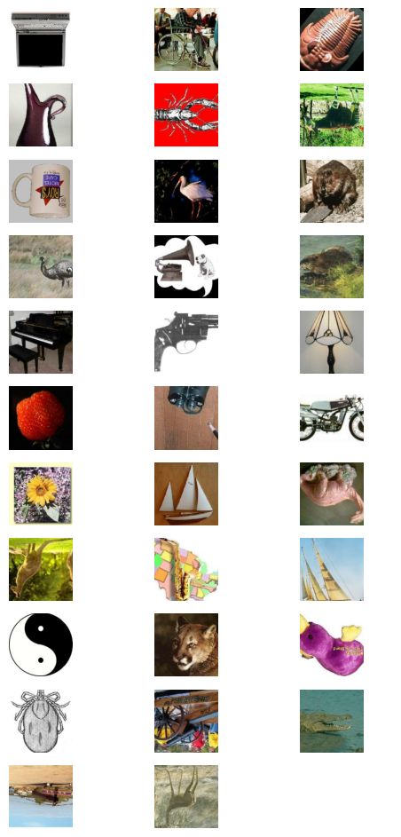
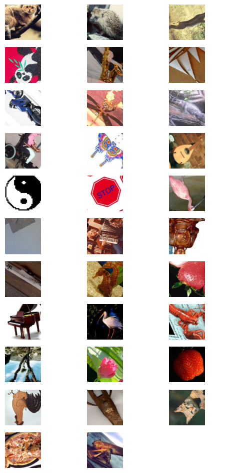
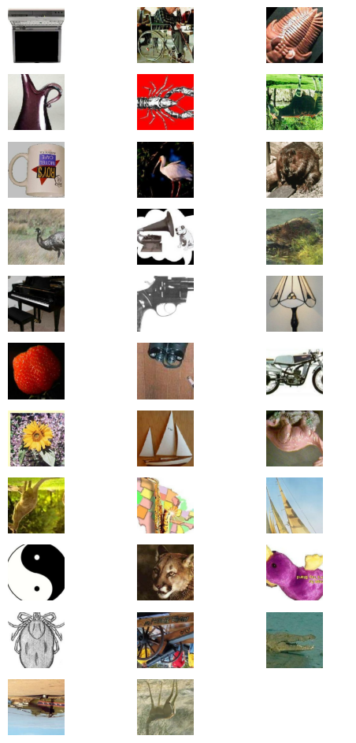
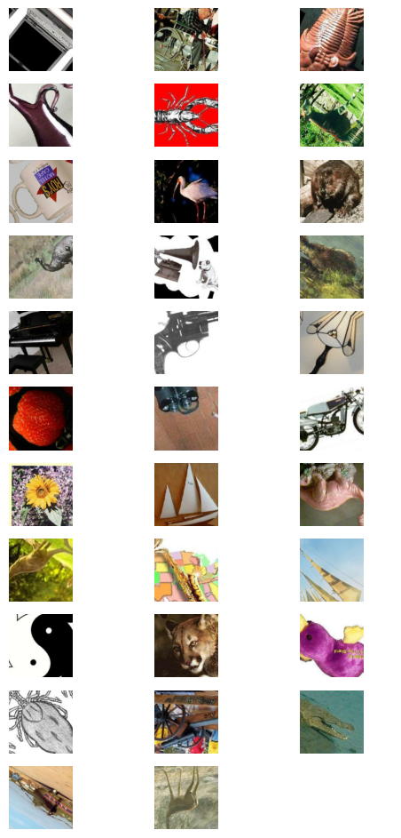

# Classification with KerasHub

**Author:** [Gowtham Paimagam](https://github.com/gowthamkpr), [lukewood](https://lukewood.xyz)<br>
**Date created:** 09/24/2024<br>
**Last modified:** 10/04/2024<br>
**Description:** Use KerasHub to train powerful image classifiers.


 [**View in Colab**](https://colab.research.google.com/github/keras-team/keras-io/blob/master/guides/ipynb/keras_hub/classification_with_keras_hub.ipynb)  <span class="k-dot">•</span> [**GitHub source**](https://github.com/keras-team/keras-io/blob/master/guides/keras_hub/classification_with_keras_hub.py)


Classification is the process of predicting a categorical label for a given
input image.
While classification is a relatively straightforward computer vision task,
modern approaches still are built of several complex components.
Luckily, Keras provides APIs to construct commonly used components.

This guide demonstrates KerasHub's modular approach to solving image
classification problems at three levels of complexity:

- Inference with a pretrained classifier
- Fine-tuning a pretrained backbone
- Training a image classifier from scratch

KerasHub uses Keras 3 to work with any of TensorFlow, PyTorch or Jax. In the
guide below, we will use the `jax` backend. This guide runs in
TensorFlow or PyTorch backends with zero changes, simply update the
`KERAS_BACKEND` below.

We use Professor Keras, the official Keras mascot, as a
visual reference for the complexity of the material:


```python
!!pip install -q git+https://github.com/keras-team/keras-hub.git
!!pip install -q --upgrade keras  # Upgrade to Keras 3.
```


```python
import os

os.environ["KERAS_BACKEND"] = "jax"  # @param ["tensorflow", "jax", "torch"]

import json
import math
import numpy as np
import matplotlib.pyplot as plt

import keras
from keras import losses
from keras import ops
from keras import optimizers
from keras.optimizers import schedules
from keras import metrics
from keras.applications.imagenet_utils import decode_predictions
import keras_hub

# Import tensorflow for `tf.data` and its preprocessing functions
import tensorflow as tf
import tensorflow_datasets as tfds

```
<div class="k-default-codeblock">
```
['',
 '\x1b[1m[\x1b[0m\x1b[34;49mnotice\x1b[0m\x1b[1;39;49m]\x1b[0m\x1b[39;49m A new release of pip is available: \x1b[0m\x1b[31;49m23.0.1\x1b[0m\x1b[39;49m -> \x1b[0m\x1b[32;49m24.2\x1b[0m',
 '\x1b[1m[\x1b[0m\x1b[34;49mnotice\x1b[0m\x1b[1;39;49m]\x1b[0m\x1b[39;49m To update, run: \x1b[0m\x1b[32;49mpip install --upgrade pip\x1b[0m']

```
</div>
---
## Inference with a pretrained classifier


Let's get started with the simplest KerasHub API: a pretrained classifier.
In this example, we will construct a classifier that was
pretrained on the ImageNet dataset.
We'll use this model to solve the age old "Cat or Dog" problem.

The highest level module in KerasHub is a *task*. A *task* is a `keras.Model`
consisting of a (generally pretrained) backbone model and task-specific layers.
Here's an example using `keras_hub.models.ImageClassifier` with an
ResNet Backbone.

ResNet is a great starting model when constructing an image
classification pipeline.
This architecture manages to achieve high accuracy, while using a
compact parameter count.
If a ResNet is not powerful enough for the task you are hoping to
solve, be sure to check out
[KerasHub's other available Backbones](https://github.com/keras-team/keras-hub/tree/master/keras_hub/src/models)!


```python
classifier = keras_hub.models.ImageClassifier.from_preset("resnet_v2_50_imagenet")
```

You may notice a small deviation from the old `keras.applications` API; where
you would construct the class with `Resnet50V2(weights="imagenet")`.
While the old API was great for classification, it did not scale effectively to
other use cases that required complex architectures, like object detection and
semantic segmentation.

We first create a utility function for plotting images throughout this tutorial:


```python

def plot_image_gallery(images, titles=None, num_cols=3, figsize=(6, 12)):
    num_images = len(images)
    images = np.asarray(images) / 255.0
    images = np.minimum(np.maximum(images, 0.0), 1.0)
    num_rows = (num_images + num_cols - 1) // num_cols
    fig, axes = plt.subplots(num_rows, num_cols, figsize=figsize, squeeze=False)
    axes = axes.flatten()  # Flatten in case the axes is a 2D array

    for i, ax in enumerate(axes):
        if i < num_images:
            # Plot the image
            ax.imshow(images[i])
            ax.axis("off")  # Remove axis
            if titles and len(titles) > i:
                ax.set_title(titles[i], fontsize=12)
        else:
            # Turn off the axis for any empty subplot
            ax.axis("off")

    plt.show()
    plt.close()

```

Now that our classifier is built, let's apply it to this cute cat picture!


```python
filepath = keras.utils.get_file(
    origin="https://upload.wikimedia.org/wikipedia/commons/thumb/4/49/5hR96puA_VA.jpg/1024px-5hR96puA_VA.jpg"
)
image = keras.utils.load_img(filepath)
image = np.array([image])
plot_image_gallery(image, num_cols=1, figsize=(3, 3))
```


    

    


Next, let's get some predictions from our classifier:


```python
predictions = classifier.predict(image)
```

    
 1/1 ━━━━━━━━━━━━━━━━━━━━ 0s 12s/step

<div class="k-default-codeblock">
```

```
</div>
 1/1 ━━━━━━━━━━━━━━━━━━━━ 12s 12s/step


Predictions come in the form of softmax-ed category rankings.
We can use Keras' `imagenet_utils.decode_predictions` function to map
them to class names:


```python
print(f"Top two classes are:\n{decode_predictions(predictions, top=2)}")
```

<div class="k-default-codeblock">
```
Downloading data from https://storage.googleapis.com/download.tensorflow.org/data/imagenet_class_index.json

```
</div>
    
     0/35363 ━━━━━━━━━━━━━━━━━━━━  0s 0s/step

<div class="k-default-codeblock">
```

```
</div>
 35363/35363 ━━━━━━━━━━━━━━━━━━━━ 0s 0us/step


<div class="k-default-codeblock">
```
Top two classes are:
[[('n02123394', 'Persian_cat', -1.3963771), ('n02808304', 'bath_towel', -2.0231562)]]

```
</div>
Great!  Both of these appear to be correct!
However, one of the classes is "Bath towel".
We're trying to classify Cats VS Dogs.
We don't care about the towel!

Ideally, we'd have a classifier that only performs computation to determine if
an image is a cat or a dog, and has all of its resources dedicated to this task.
This can be solved by fine tuning our own classifier.

---
## Fine tuning a pretrained classifier


When labeled images specific to our task are available, fine-tuning a custom
classifier can improve performance.
If we want to train a Cats vs Dogs Classifier, using explicitly labeled Cat vs
Dog data should perform better than the generic classifier!
For many tasks, no relevant pretrained model
will be available (e.g., categorizing images specific to your application).

First, let's get started by loading some data:


```python
BATCH_SIZE = 32
IMAGE_SIZE = (224, 224)
AUTOTUNE = tf.data.AUTOTUNE
tfds.disable_progress_bar()

data, dataset_info = tfds.load("cats_vs_dogs", with_info=True, as_supervised=True)
train_steps_per_epoch = dataset_info.splits["train"].num_examples // BATCH_SIZE
train_dataset = data["train"]

num_classes = dataset_info.features["label"].num_classes

resizing = keras.layers.Resizing(
    IMAGE_SIZE[0], IMAGE_SIZE[1], crop_to_aspect_ratio=True
)


def preprocess_inputs(image, label):
    image = tf.cast(image, tf.float32)
    # Staticly resize images as we only iterate the dataset once.
    return resizing(image), tf.one_hot(label, num_classes)


# Shuffle the dataset to increase diversity of batches.
# 10*BATCH_SIZE follows the assumption that bigger machines can handle bigger
# shuffle buffers.
train_dataset = train_dataset.shuffle(
    10 * BATCH_SIZE, reshuffle_each_iteration=True
).map(preprocess_inputs, num_parallel_calls=AUTOTUNE)
train_dataset = train_dataset.batch(BATCH_SIZE)

images = next(iter(train_dataset.take(1)))[0]
plot_image_gallery(images)
```


    

    


Meow!

Next let's construct our model.
The use of imagenet in the preset name indicates that the backbone was
pretrained on the ImageNet dataset.
Pretrained backbones extract more information from our labeled examples by
leveraging patterns extracted from potentially much larger datasets.

Next lets put together our classifier:


```python
model = keras_hub.models.ImageClassifier.from_preset(
    "resnet_v2_50_imagenet", num_classes=2
)
model.compile(
    loss="categorical_crossentropy",
    optimizer=keras.optimizers.SGD(learning_rate=0.01),
    metrics=["accuracy"],
)
```

Here our classifier is just a simple `keras.Sequential`.
All that is left to do is call `model.fit()`:


```python
model.fit(train_dataset)

```

    
   1/727 ━━━━━━━━━━━━━━━━━━━━  4:54:54 24s/step - accuracy: 0.5312 - loss: 4.9475
   2/727 ━━━━━━━━━━━━━━━━━━━━  2:59 247ms/step - accuracy: 0.5469 - loss: 4.9475

    
   3/727 ━━━━━━━━━━━━━━━━━━━━  2:51 236ms/step - accuracy: 0.5660 - loss: 4.9475

<div class="k-default-codeblock">
```

```
</div>
   4/727 ━━━━━━━━━━━━━━━━━━━━  2:50 236ms/step - accuracy: 0.5651 - loss: 4.6897

<div class="k-default-codeblock">
```

```
</div>
   5/727 ━━━━━━━━━━━━━━━━━━━━  2:50 236ms/step - accuracy: 0.5608 - loss: 4.4102

<div class="k-default-codeblock">
```

```
</div>
   6/727 ━━━━━━━━━━━━━━━━━━━━  2:50 236ms/step - accuracy: 0.5559 - loss: 4.1523

<div class="k-default-codeblock">
```

```
</div>
   7/727 ━━━━━━━━━━━━━━━━━━━━  2:50 236ms/step - accuracy: 0.5556 - loss: 3.9214

<div class="k-default-codeblock">
```

```
</div>
   8/727 ━━━━━━━━━━━━━━━━━━━━  2:49 236ms/step - accuracy: 0.5564 - loss: 3.7174

<div class="k-default-codeblock">
```

```
</div>
   9/727 ━━━━━━━━━━━━━━━━━━━━  2:49 236ms/step - accuracy: 0.5567 - loss: 3.5383

<div class="k-default-codeblock">
```

```
</div>
  10/727 ━━━━━━━━━━━━━━━━━━━━  2:49 236ms/step - accuracy: 0.5561 - loss: 3.3807

<div class="k-default-codeblock">
```

```
</div>
  11/727 ━━━━━━━━━━━━━━━━━━━━  2:48 236ms/step - accuracy: 0.5566 - loss: 3.2405

<div class="k-default-codeblock">
```

```
</div>
  12/727 ━━━━━━━━━━━━━━━━━━━━  2:48 236ms/step - accuracy: 0.5582 - loss: 3.1147

<div class="k-default-codeblock">
```

```
</div>
  13/727 ━━━━━━━━━━━━━━━━━━━━  2:48 236ms/step - accuracy: 0.5608 - loss: 3.0011

<div class="k-default-codeblock">
```

```
</div>
  14/727 ━━━━━━━━━━━━━━━━━━━━  2:48 236ms/step - accuracy: 0.5639 - loss: 2.8983

<div class="k-default-codeblock">
```

```
</div>
  15/727 ━━━━━━━━━━━━━━━━━━━━  2:47 236ms/step - accuracy: 0.5678 - loss: 2.8044

<div class="k-default-codeblock">
```

```
</div>
  16/727 ━━━━━━━━━━━━━━━━━━━━  2:47 236ms/step - accuracy: 0.5719 - loss: 2.7184

<div class="k-default-codeblock">
```

```
</div>
  17/727 ━━━━━━━━━━━━━━━━━━━━  2:47 236ms/step - accuracy: 0.5758 - loss: 2.6395

<div class="k-default-codeblock">
```

```
</div>
  18/727 ━━━━━━━━━━━━━━━━━━━━  2:47 236ms/step - accuracy: 0.5796 - loss: 2.5668

<div class="k-default-codeblock">
```

```
</div>
  19/727 ━━━━━━━━━━━━━━━━━━━━  2:47 236ms/step - accuracy: 0.5836 - loss: 2.4994

<div class="k-default-codeblock">
```

```
</div>
  20/727 ━━━━━━━━━━━━━━━━━━━━  2:46 236ms/step - accuracy: 0.5879 - loss: 2.4367

<div class="k-default-codeblock">
```

```
</div>
  21/727 ━━━━━━━━━━━━━━━━━━━━  2:46 236ms/step - accuracy: 0.5922 - loss: 2.3782

<div class="k-default-codeblock">
```

```
</div>
  22/727 ━━━━━━━━━━━━━━━━━━━━  2:46 236ms/step - accuracy: 0.5963 - loss: 2.3235

<div class="k-default-codeblock">
```

```
</div>
  23/727 ━━━━━━━━━━━━━━━━━━━━  2:46 236ms/step - accuracy: 0.6005 - loss: 2.2723

<div class="k-default-codeblock">
```

```
</div>
  24/727 ━━━━━━━━━━━━━━━━━━━━  2:45 236ms/step - accuracy: 0.6046 - loss: 2.2241

<div class="k-default-codeblock">
```

```
</div>
  25/727 ━━━━━━━━━━━━━━━━━━━━  2:45 236ms/step - accuracy: 0.6087 - loss: 2.1786

<div class="k-default-codeblock">
```

```
</div>
  26/727 ━━━━━━━━━━━━━━━━━━━━  2:45 236ms/step - accuracy: 0.6127 - loss: 2.1356

<div class="k-default-codeblock">
```

```
</div>
  27/727 ━━━━━━━━━━━━━━━━━━━━  2:45 236ms/step - accuracy: 0.6168 - loss: 2.0949

<div class="k-default-codeblock">
```

```
</div>
  28/727 ━━━━━━━━━━━━━━━━━━━━  2:45 236ms/step - accuracy: 0.6208 - loss: 2.0562

<div class="k-default-codeblock">
```

```
</div>
  29/727 ━━━━━━━━━━━━━━━━━━━━  2:44 236ms/step - accuracy: 0.6246 - loss: 2.0194

<div class="k-default-codeblock">
```

```
</div>
  30/727 ━━━━━━━━━━━━━━━━━━━━  2:44 236ms/step - accuracy: 0.6283 - loss: 1.9844

<div class="k-default-codeblock">
```

```
</div>
  31/727 ━━━━━━━━━━━━━━━━━━━━  2:44 236ms/step - accuracy: 0.6320 - loss: 1.9510

<div class="k-default-codeblock">
```

```
</div>
  32/727 ━━━━━━━━━━━━━━━━━━━━  2:44 236ms/step - accuracy: 0.6357 - loss: 1.9189

<div class="k-default-codeblock">
```

```
</div>
  33/727 ━━━━━━━━━━━━━━━━━━━━  2:43 236ms/step - accuracy: 0.6394 - loss: 1.8880

<div class="k-default-codeblock">
```

```
</div>
  34/727 ━━━━━━━━━━━━━━━━━━━━  2:43 236ms/step - accuracy: 0.6431 - loss: 1.8583

<div class="k-default-codeblock">
```

```
</div>
  35/727 ━━━━━━━━━━━━━━━━━━━━  2:43 236ms/step - accuracy: 0.6466 - loss: 1.8306

<div class="k-default-codeblock">
```

```
</div>
  36/727 ━━━━━━━━━━━━━━━━━━━━  2:43 236ms/step - accuracy: 0.6501 - loss: 1.8043

<div class="k-default-codeblock">
```

```
</div>
  37/727 ━━━━━━━━━━━━━━━━━━━━  2:43 236ms/step - accuracy: 0.6535 - loss: 1.7796

<div class="k-default-codeblock">
```

```
</div>
  38/727 ━━━━━━━━━━━━━━━━━━━━  2:42 236ms/step - accuracy: 0.6568 - loss: 1.7567

<div class="k-default-codeblock">
```

```
</div>
  39/727 ━━━━━━━━━━━━━━━━━━━━  2:42 236ms/step - accuracy: 0.6600 - loss: 1.7353

<div class="k-default-codeblock">
```

```
</div>
  40/727 ━━━━━━━━━━━━━━━━━━━━  2:42 236ms/step - accuracy: 0.6629 - loss: 1.7152

<div class="k-default-codeblock">
```

```
</div>
  41/727 ━━━━━━━━━━━━━━━━━━━━  2:42 236ms/step - accuracy: 0.6653 - loss: 1.6963

<div class="k-default-codeblock">
```

```
</div>
  42/727 ━━━━━━━━━━━━━━━━━━━━  2:41 236ms/step - accuracy: 0.6675 - loss: 1.6784

<div class="k-default-codeblock">
```

```
</div>
  43/727 ━━━━━━━━━━━━━━━━━━━━  2:41 236ms/step - accuracy: 0.6696 - loss: 1.6613

<div class="k-default-codeblock">
```

```
</div>
  44/727 ━━━━━━━━━━━━━━━━━━━━  2:41 236ms/step - accuracy: 0.6713 - loss: 1.6452

<div class="k-default-codeblock">
```

```
</div>
  45/727 ━━━━━━━━━━━━━━━━━━━━  2:41 236ms/step - accuracy: 0.6728 - loss: 1.6298

<div class="k-default-codeblock">
```

```
</div>
  46/727 ━━━━━━━━━━━━━━━━━━━━  2:40 236ms/step - accuracy: 0.6741 - loss: 1.6151

<div class="k-default-codeblock">
```

```
</div>
  47/727 ━━━━━━━━━━━━━━━━━━━━  2:40 236ms/step - accuracy: 0.6752 - loss: 1.6011

<div class="k-default-codeblock">
```

```
</div>
  48/727 ━━━━━━━━━━━━━━━━━━━━  2:40 236ms/step - accuracy: 0.6762 - loss: 1.5876

<div class="k-default-codeblock">
```

```
</div>
  49/727 ━━━━━━━━━━━━━━━━━━━━  2:40 236ms/step - accuracy: 0.6771 - loss: 1.5747

<div class="k-default-codeblock">
```

```
</div>
  50/727 ━━━━━━━━━━━━━━━━━━━━  2:40 236ms/step - accuracy: 0.6778 - loss: 1.5623

<div class="k-default-codeblock">
```

```
</div>
  51/727 ━━━━━━━━━━━━━━━━━━━━  2:39 236ms/step - accuracy: 0.6785 - loss: 1.5502

<div class="k-default-codeblock">
```

```
</div>
  52/727 ━━━━━━━━━━━━━━━━━━━━  2:39 236ms/step - accuracy: 0.6790 - loss: 1.5386

<div class="k-default-codeblock">
```

```
</div>
  53/727 ━━━━━━━━━━━━━━━━━━━━  2:39 236ms/step - accuracy: 0.6795 - loss: 1.5273

<div class="k-default-codeblock">
```

```
</div>
  54/727 ━━━━━━━━━━━━━━━━━━━━  2:39 236ms/step - accuracy: 0.6800 - loss: 1.5163

<div class="k-default-codeblock">
```

```
</div>
  55/727 ━━━━━━━━━━━━━━━━━━━━  2:38 236ms/step - accuracy: 0.6803 - loss: 1.5057

<div class="k-default-codeblock">
```

```
</div>
  56/727 ━━━━━━━━━━━━━━━━━━━━  2:38 236ms/step - accuracy: 0.6806 - loss: 1.4955

<div class="k-default-codeblock">
```

```
</div>
  57/727 ━━━━━━━━━━━━━━━━━━━━  2:38 236ms/step - accuracy: 0.6808 - loss: 1.4856

<div class="k-default-codeblock">
```

```
</div>
  58/727 ━━━━━━━━━━━━━━━━━━━━  2:38 236ms/step - accuracy: 0.6810 - loss: 1.4760

<div class="k-default-codeblock">
```

```
</div>
  59/727 ━━━━━━━━━━━━━━━━━━━━  2:37 236ms/step - accuracy: 0.6811 - loss: 1.4667

<div class="k-default-codeblock">
```

```
</div>
  60/727 ━━━━━━━━━━━━━━━━━━━━  2:37 237ms/step - accuracy: 0.6811 - loss: 1.4577

<div class="k-default-codeblock">
```

```
</div>
  61/727 ━━━━━━━━━━━━━━━━━━━━  2:37 237ms/step - accuracy: 0.6810 - loss: 1.4489

<div class="k-default-codeblock">
```

```
</div>
  62/727 ━━━━━━━━━━━━━━━━━━━━  2:37 237ms/step - accuracy: 0.6809 - loss: 1.4405

<div class="k-default-codeblock">
```

```
</div>
  63/727 ━━━━━━━━━━━━━━━━━━━━  2:37 236ms/step - accuracy: 0.6808 - loss: 1.4322

<div class="k-default-codeblock">
```

```
</div>
  64/727 ━━━━━━━━━━━━━━━━━━━━  2:36 236ms/step - accuracy: 0.6806 - loss: 1.4242

<div class="k-default-codeblock">
```

```
</div>
  65/727 ━━━━━━━━━━━━━━━━━━━━  2:36 237ms/step - accuracy: 0.6804 - loss: 1.4163

<div class="k-default-codeblock">
```

```
</div>
  66/727 ━━━━━━━━━━━━━━━━━━━━  2:36 237ms/step - accuracy: 0.6802 - loss: 1.4087

<div class="k-default-codeblock">
```

```
</div>
  67/727 ━━━━━━━━━━━━━━━━━━━━  2:36 237ms/step - accuracy: 0.6799 - loss: 1.4013

<div class="k-default-codeblock">
```

```
</div>
  68/727 ━━━━━━━━━━━━━━━━━━━━  2:35 236ms/step - accuracy: 0.6796 - loss: 1.3940

<div class="k-default-codeblock">
```

```
</div>
  69/727 ━━━━━━━━━━━━━━━━━━━━  2:35 237ms/step - accuracy: 0.6793 - loss: 1.3870

<div class="k-default-codeblock">
```

```
</div>
  70/727 ━━━━━━━━━━━━━━━━━━━━  2:35 237ms/step - accuracy: 0.6789 - loss: 1.3801

<div class="k-default-codeblock">
```

```
</div>
  71/727 ━━━━━━━━━━━━━━━━━━━━  2:35 237ms/step - accuracy: 0.6785 - loss: 1.3734

<div class="k-default-codeblock">
```

```
</div>
  72/727 ━━━━━━━━━━━━━━━━━━━━  2:34 237ms/step - accuracy: 0.6781 - loss: 1.3669

<div class="k-default-codeblock">
```

```
</div>
  73/727 ━━━━━━━━━━━━━━━━━━━━  2:34 237ms/step - accuracy: 0.6777 - loss: 1.3606

<div class="k-default-codeblock">
```

```
</div>
  74/727 ━━━━━━━━━━━━━━━━━━━━  2:34 237ms/step - accuracy: 0.6772 - loss: 1.3544

<div class="k-default-codeblock">
```

```
</div>
  75/727 ━━━━━━━━━━━━━━━━━━━━  2:34 237ms/step - accuracy: 0.6767 - loss: 1.3483

<div class="k-default-codeblock">
```

```
</div>
  76/727 ━━━━━━━━━━━━━━━━━━━━  2:34 237ms/step - accuracy: 0.6762 - loss: 1.3424

<div class="k-default-codeblock">
```

```
</div>
  77/727 ━━━━━━━━━━━━━━━━━━━━  2:33 237ms/step - accuracy: 0.6757 - loss: 1.3366

<div class="k-default-codeblock">
```

```
</div>
  78/727 ━━━━━━━━━━━━━━━━━━━━  2:33 237ms/step - accuracy: 0.6752 - loss: 1.3309

<div class="k-default-codeblock">
```

```
</div>
  79/727 ━━━━━━━━━━━━━━━━━━━━  2:33 237ms/step - accuracy: 0.6746 - loss: 1.3254

<div class="k-default-codeblock">
```

```
</div>
  80/727 ━━━━━━━━━━━━━━━━━━━━  2:33 237ms/step - accuracy: 0.6741 - loss: 1.3199

<div class="k-default-codeblock">
```

```
</div>
  81/727 ━━━━━━━━━━━━━━━━━━━━  2:32 237ms/step - accuracy: 0.6736 - loss: 1.3146

<div class="k-default-codeblock">
```

```
</div>
  82/727 ━━━━━━━━━━━━━━━━━━━━  2:32 237ms/step - accuracy: 0.6730 - loss: 1.3093

<div class="k-default-codeblock">
```

```
</div>
  83/727 ━━━━━━━━━━━━━━━━━━━━  2:32 237ms/step - accuracy: 0.6725 - loss: 1.3042

<div class="k-default-codeblock">
```

```
</div>
  84/727 ━━━━━━━━━━━━━━━━━━━━  2:32 237ms/step - accuracy: 0.6720 - loss: 1.2991

<div class="k-default-codeblock">
```

```
</div>
  85/727 ━━━━━━━━━━━━━━━━━━━━  2:31 237ms/step - accuracy: 0.6714 - loss: 1.2941

<div class="k-default-codeblock">
```

```
</div>
  86/727 ━━━━━━━━━━━━━━━━━━━━  2:31 237ms/step - accuracy: 0.6709 - loss: 1.2893

<div class="k-default-codeblock">
```

```
</div>
  87/727 ━━━━━━━━━━━━━━━━━━━━  2:31 237ms/step - accuracy: 0.6703 - loss: 1.2845

<div class="k-default-codeblock">
```

```
</div>
  88/727 ━━━━━━━━━━━━━━━━━━━━  2:31 237ms/step - accuracy: 0.6697 - loss: 1.2799

<div class="k-default-codeblock">
```

```
</div>
  89/727 ━━━━━━━━━━━━━━━━━━━━  2:31 237ms/step - accuracy: 0.6691 - loss: 1.2753

<div class="k-default-codeblock">
```

```
</div>
  90/727 ━━━━━━━━━━━━━━━━━━━━  2:30 237ms/step - accuracy: 0.6685 - loss: 1.2709

<div class="k-default-codeblock">
```

```
</div>
  91/727 ━━━━━━━━━━━━━━━━━━━━  2:30 237ms/step - accuracy: 0.6680 - loss: 1.2665

<div class="k-default-codeblock">
```

```
</div>
  92/727 ━━━━━━━━━━━━━━━━━━━━  2:30 237ms/step - accuracy: 0.6674 - loss: 1.2622

<div class="k-default-codeblock">
```

```
</div>
  93/727 ━━━━━━━━━━━━━━━━━━━━  2:30 237ms/step - accuracy: 0.6668 - loss: 1.2579

<div class="k-default-codeblock">
```

```
</div>
  94/727 ━━━━━━━━━━━━━━━━━━━━  2:29 237ms/step - accuracy: 0.6662 - loss: 1.2537

<div class="k-default-codeblock">
```

```
</div>
  95/727 ━━━━━━━━━━━━━━━━━━━━  2:29 237ms/step - accuracy: 0.6656 - loss: 1.2496

<div class="k-default-codeblock">
```

```
</div>
  96/727 ━━━━━━━━━━━━━━━━━━━━  2:29 237ms/step - accuracy: 0.6650 - loss: 1.2456

<div class="k-default-codeblock">
```

```
</div>
  97/727 ━━━━━━━━━━━━━━━━━━━━  2:29 237ms/step - accuracy: 0.6644 - loss: 1.2416

<div class="k-default-codeblock">
```

```
</div>
  98/727 ━━━━━━━━━━━━━━━━━━━━  2:28 237ms/step - accuracy: 0.6638 - loss: 1.2377

<div class="k-default-codeblock">
```

```
</div>
  99/727 ━━━━━━━━━━━━━━━━━━━━  2:28 237ms/step - accuracy: 0.6633 - loss: 1.2338

<div class="k-default-codeblock">
```

```
</div>
 100/727 ━━━━━━━━━━━━━━━━━━━━  2:28 237ms/step - accuracy: 0.6627 - loss: 1.2300

<div class="k-default-codeblock">
```

```
</div>
 101/727 ━━━━━━━━━━━━━━━━━━━━  2:28 237ms/step - accuracy: 0.6621 - loss: 1.2263

<div class="k-default-codeblock">
```

```
</div>
 102/727 ━━━━━━━━━━━━━━━━━━━━  2:28 237ms/step - accuracy: 0.6616 - loss: 1.2226

<div class="k-default-codeblock">
```

```
</div>
 103/727 ━━━━━━━━━━━━━━━━━━━━  2:27 237ms/step - accuracy: 0.6610 - loss: 1.2189

<div class="k-default-codeblock">
```

```
</div>
 104/727 ━━━━━━━━━━━━━━━━━━━━  2:27 237ms/step - accuracy: 0.6605 - loss: 1.2154

<div class="k-default-codeblock">
```

```
</div>
 105/727 ━━━━━━━━━━━━━━━━━━━━  2:27 237ms/step - accuracy: 0.6599 - loss: 1.2118

<div class="k-default-codeblock">
```

```
</div>
 106/727 ━━━━━━━━━━━━━━━━━━━━  2:27 237ms/step - accuracy: 0.6594 - loss: 1.2084

<div class="k-default-codeblock">
```

```
</div>
 107/727 ━━━━━━━━━━━━━━━━━━━━  2:26 237ms/step - accuracy: 0.6588 - loss: 1.2049

<div class="k-default-codeblock">
```

```
</div>
 108/727 ━━━━━━━━━━━━━━━━━━━━  2:26 237ms/step - accuracy: 0.6583 - loss: 1.2015

<div class="k-default-codeblock">
```

```
</div>
 109/727 ━━━━━━━━━━━━━━━━━━━━  2:26 237ms/step - accuracy: 0.6578 - loss: 1.1982

<div class="k-default-codeblock">
```

```
</div>
 110/727 ━━━━━━━━━━━━━━━━━━━━  2:26 237ms/step - accuracy: 0.6572 - loss: 1.1949

<div class="k-default-codeblock">
```

```
</div>
 111/727 ━━━━━━━━━━━━━━━━━━━━  2:25 237ms/step - accuracy: 0.6567 - loss: 1.1917

<div class="k-default-codeblock">
```

```
</div>
 112/727 ━━━━━━━━━━━━━━━━━━━━  2:25 237ms/step - accuracy: 0.6562 - loss: 1.1885

<div class="k-default-codeblock">
```

```
</div>
 113/727 ━━━━━━━━━━━━━━━━━━━━  2:25 237ms/step - accuracy: 0.6556 - loss: 1.1853

<div class="k-default-codeblock">
```

```
</div>
 114/727 ━━━━━━━━━━━━━━━━━━━━  2:25 237ms/step - accuracy: 0.6551 - loss: 1.1822

<div class="k-default-codeblock">
```

```
</div>
 115/727 ━━━━━━━━━━━━━━━━━━━━  2:25 237ms/step - accuracy: 0.6546 - loss: 1.1791

<div class="k-default-codeblock">
```

```
</div>
 116/727 ━━━━━━━━━━━━━━━━━━━━  2:24 237ms/step - accuracy: 0.6541 - loss: 1.1761

<div class="k-default-codeblock">
```

```
</div>
 117/727 ━━━━━━━━━━━━━━━━━━━━  2:24 237ms/step - accuracy: 0.6536 - loss: 1.1731

<div class="k-default-codeblock">
```

```
</div>
 118/727 ━━━━━━━━━━━━━━━━━━━━  2:24 237ms/step - accuracy: 0.6531 - loss: 1.1701

<div class="k-default-codeblock">
```

```
</div>
 119/727 ━━━━━━━━━━━━━━━━━━━━  2:24 237ms/step - accuracy: 0.6526 - loss: 1.1672

<div class="k-default-codeblock">
```

```
</div>
 120/727 ━━━━━━━━━━━━━━━━━━━━  2:23 237ms/step - accuracy: 0.6521 - loss: 1.1643

<div class="k-default-codeblock">
```

```
</div>
 121/727 ━━━━━━━━━━━━━━━━━━━━  2:23 237ms/step - accuracy: 0.6516 - loss: 1.1615

<div class="k-default-codeblock">
```

```
</div>
 122/727 ━━━━━━━━━━━━━━━━━━━━  2:23 237ms/step - accuracy: 0.6511 - loss: 1.1587

<div class="k-default-codeblock">
```

```
</div>
 123/727 ━━━━━━━━━━━━━━━━━━━━  2:23 237ms/step - accuracy: 0.6506 - loss: 1.1559

<div class="k-default-codeblock">
```

```
</div>
 124/727 ━━━━━━━━━━━━━━━━━━━━  2:22 237ms/step - accuracy: 0.6501 - loss: 1.1532

<div class="k-default-codeblock">
```

```
</div>
 125/727 ━━━━━━━━━━━━━━━━━━━━  2:22 237ms/step - accuracy: 0.6496 - loss: 1.1505

<div class="k-default-codeblock">
```

```
</div>
 126/727 ━━━━━━━━━━━━━━━━━━━━  2:22 237ms/step - accuracy: 0.6491 - loss: 1.1478

<div class="k-default-codeblock">
```

```
</div>
 127/727 ━━━━━━━━━━━━━━━━━━━━  2:22 237ms/step - accuracy: 0.6486 - loss: 1.1452

<div class="k-default-codeblock">
```

```
</div>
 128/727 ━━━━━━━━━━━━━━━━━━━━  2:22 237ms/step - accuracy: 0.6481 - loss: 1.1426

<div class="k-default-codeblock">
```

```
</div>
 129/727 ━━━━━━━━━━━━━━━━━━━━  2:21 237ms/step - accuracy: 0.6476 - loss: 1.1400

<div class="k-default-codeblock">
```

```
</div>
 130/727 ━━━━━━━━━━━━━━━━━━━━  2:21 237ms/step - accuracy: 0.6471 - loss: 1.1375

<div class="k-default-codeblock">
```

```
</div>
 131/727 ━━━━━━━━━━━━━━━━━━━━  2:21 237ms/step - accuracy: 0.6466 - loss: 1.1350

<div class="k-default-codeblock">
```

```
</div>
 132/727 ━━━━━━━━━━━━━━━━━━━━  2:21 237ms/step - accuracy: 0.6461 - loss: 1.1325

<div class="k-default-codeblock">
```

```
</div>
 133/727 ━━━━━━━━━━━━━━━━━━━━  2:20 237ms/step - accuracy: 0.6456 - loss: 1.1301

<div class="k-default-codeblock">
```

```
</div>
 134/727 ━━━━━━━━━━━━━━━━━━━━  2:20 237ms/step - accuracy: 0.6451 - loss: 1.1277

<div class="k-default-codeblock">
```

```
</div>
 135/727 ━━━━━━━━━━━━━━━━━━━━  2:20 237ms/step - accuracy: 0.6446 - loss: 1.1253

<div class="k-default-codeblock">
```

```
</div>
 136/727 ━━━━━━━━━━━━━━━━━━━━  2:20 237ms/step - accuracy: 0.6441 - loss: 1.1229

<div class="k-default-codeblock">
```

```
</div>
 137/727 ━━━━━━━━━━━━━━━━━━━━  2:19 237ms/step - accuracy: 0.6436 - loss: 1.1206

<div class="k-default-codeblock">
```

```
</div>
 138/727 ━━━━━━━━━━━━━━━━━━━━  2:19 237ms/step - accuracy: 0.6431 - loss: 1.1183

<div class="k-default-codeblock">
```

```
</div>
 139/727 ━━━━━━━━━━━━━━━━━━━━  2:19 237ms/step - accuracy: 0.6426 - loss: 1.1160

<div class="k-default-codeblock">
```

```
</div>
 140/727 ━━━━━━━━━━━━━━━━━━━━  2:19 237ms/step - accuracy: 0.6421 - loss: 1.1137

<div class="k-default-codeblock">
```

```
</div>
 141/727 ━━━━━━━━━━━━━━━━━━━━  2:19 237ms/step - accuracy: 0.6417 - loss: 1.1115

<div class="k-default-codeblock">
```

```
</div>
 142/727 ━━━━━━━━━━━━━━━━━━━━  2:18 237ms/step - accuracy: 0.6412 - loss: 1.1093

<div class="k-default-codeblock">
```

```
</div>
 143/727 ━━━━━━━━━━━━━━━━━━━━  2:18 237ms/step - accuracy: 0.6407 - loss: 1.1071

<div class="k-default-codeblock">
```

```
</div>
 144/727 ━━━━━━━━━━━━━━━━━━━━  2:18 237ms/step - accuracy: 0.6402 - loss: 1.1050

<div class="k-default-codeblock">
```

```
</div>
 145/727 ━━━━━━━━━━━━━━━━━━━━  2:18 237ms/step - accuracy: 0.6397 - loss: 1.1028

<div class="k-default-codeblock">
```

```
</div>
 146/727 ━━━━━━━━━━━━━━━━━━━━  2:17 237ms/step - accuracy: 0.6393 - loss: 1.1007

<div class="k-default-codeblock">
```

```
</div>
 147/727 ━━━━━━━━━━━━━━━━━━━━  2:17 237ms/step - accuracy: 0.6388 - loss: 1.0986

<div class="k-default-codeblock">
```

```
</div>
 148/727 ━━━━━━━━━━━━━━━━━━━━  2:17 237ms/step - accuracy: 0.6383 - loss: 1.0965

<div class="k-default-codeblock">
```

```
</div>
 149/727 ━━━━━━━━━━━━━━━━━━━━  2:17 237ms/step - accuracy: 0.6378 - loss: 1.0945

<div class="k-default-codeblock">
```

```
</div>
 150/727 ━━━━━━━━━━━━━━━━━━━━  2:16 237ms/step - accuracy: 0.6374 - loss: 1.0925

<div class="k-default-codeblock">
```

```
</div>
 151/727 ━━━━━━━━━━━━━━━━━━━━  2:16 237ms/step - accuracy: 0.6369 - loss: 1.0904

<div class="k-default-codeblock">
```

```
</div>
 152/727 ━━━━━━━━━━━━━━━━━━━━  2:16 237ms/step - accuracy: 0.6365 - loss: 1.0885

<div class="k-default-codeblock">
```

```
</div>
 153/727 ━━━━━━━━━━━━━━━━━━━━  2:16 237ms/step - accuracy: 0.6360 - loss: 1.0865

<div class="k-default-codeblock">
```

```
</div>
 154/727 ━━━━━━━━━━━━━━━━━━━━  2:15 237ms/step - accuracy: 0.6356 - loss: 1.0845

<div class="k-default-codeblock">
```

```
</div>
 155/727 ━━━━━━━━━━━━━━━━━━━━  2:15 237ms/step - accuracy: 0.6351 - loss: 1.0826

<div class="k-default-codeblock">
```

```
</div>
 156/727 ━━━━━━━━━━━━━━━━━━━━  2:15 237ms/step - accuracy: 0.6347 - loss: 1.0807

<div class="k-default-codeblock">
```

```
</div>
 157/727 ━━━━━━━━━━━━━━━━━━━━  2:15 237ms/step - accuracy: 0.6343 - loss: 1.0788

<div class="k-default-codeblock">
```

```
</div>
 158/727 ━━━━━━━━━━━━━━━━━━━━  2:15 237ms/step - accuracy: 0.6338 - loss: 1.0769

<div class="k-default-codeblock">
```

```
</div>
 159/727 ━━━━━━━━━━━━━━━━━━━━  2:14 237ms/step - accuracy: 0.6334 - loss: 1.0750

<div class="k-default-codeblock">
```

```
</div>
 160/727 ━━━━━━━━━━━━━━━━━━━━  2:14 237ms/step - accuracy: 0.6329 - loss: 1.0732

<div class="k-default-codeblock">
```

```
</div>
 161/727 ━━━━━━━━━━━━━━━━━━━━  2:14 237ms/step - accuracy: 0.6325 - loss: 1.0714

<div class="k-default-codeblock">
```

```
</div>
 162/727 ━━━━━━━━━━━━━━━━━━━━  2:14 237ms/step - accuracy: 0.6321 - loss: 1.0695

<div class="k-default-codeblock">
```

```
</div>
 163/727 ━━━━━━━━━━━━━━━━━━━━  2:13 237ms/step - accuracy: 0.6316 - loss: 1.0678

<div class="k-default-codeblock">
```

```
</div>
 164/727 ━━━━━━━━━━━━━━━━━━━━  2:13 237ms/step - accuracy: 0.6312 - loss: 1.0660

<div class="k-default-codeblock">
```

```
</div>
 165/727 ━━━━━━━━━━━━━━━━━━━━  2:13 237ms/step - accuracy: 0.6308 - loss: 1.0642

<div class="k-default-codeblock">
```

```
</div>
 166/727 ━━━━━━━━━━━━━━━━━━━━  2:13 237ms/step - accuracy: 0.6304 - loss: 1.0625

<div class="k-default-codeblock">
```

```
</div>
 167/727 ━━━━━━━━━━━━━━━━━━━━  2:12 237ms/step - accuracy: 0.6300 - loss: 1.0607

<div class="k-default-codeblock">
```

```
</div>
 168/727 ━━━━━━━━━━━━━━━━━━━━  2:12 237ms/step - accuracy: 0.6295 - loss: 1.0590

<div class="k-default-codeblock">
```

```
</div>
 169/727 ━━━━━━━━━━━━━━━━━━━━  2:12 237ms/step - accuracy: 0.6291 - loss: 1.0573

<div class="k-default-codeblock">
```

```
</div>
 170/727 ━━━━━━━━━━━━━━━━━━━━  2:12 237ms/step - accuracy: 0.6287 - loss: 1.0556

<div class="k-default-codeblock">
```

```
</div>
 171/727 ━━━━━━━━━━━━━━━━━━━━  2:12 237ms/step - accuracy: 0.6283 - loss: 1.0540

<div class="k-default-codeblock">
```

```
</div>
 172/727 ━━━━━━━━━━━━━━━━━━━━  2:11 237ms/step - accuracy: 0.6279 - loss: 1.0523

<div class="k-default-codeblock">
```

```
</div>
 173/727 ━━━━━━━━━━━━━━━━━━━━  2:11 237ms/step - accuracy: 0.6275 - loss: 1.0507

<div class="k-default-codeblock">
```

```
</div>
 174/727 ━━━━━━━━━━━━━━━━━━━━  2:11 237ms/step - accuracy: 0.6271 - loss: 1.0490

<div class="k-default-codeblock">
```

```
</div>
 175/727 ━━━━━━━━━━━━━━━━━━━━  2:11 237ms/step - accuracy: 0.6267 - loss: 1.0474

<div class="k-default-codeblock">
```

```
</div>
 176/727 ━━━━━━━━━━━━━━━━━━━━  2:10 237ms/step - accuracy: 0.6264 - loss: 1.0458

<div class="k-default-codeblock">
```

```
</div>
 177/727 ━━━━━━━━━━━━━━━━━━━━  2:10 237ms/step - accuracy: 0.6260 - loss: 1.0442

<div class="k-default-codeblock">
```

```
</div>
 178/727 ━━━━━━━━━━━━━━━━━━━━  2:10 237ms/step - accuracy: 0.6256 - loss: 1.0426

<div class="k-default-codeblock">
```

```
</div>
 179/727 ━━━━━━━━━━━━━━━━━━━━  2:10 237ms/step - accuracy: 0.6252 - loss: 1.0411

<div class="k-default-codeblock">
```

```
</div>
 180/727 ━━━━━━━━━━━━━━━━━━━━  2:09 238ms/step - accuracy: 0.6249 - loss: 1.0395

<div class="k-default-codeblock">
```

```
</div>
 181/727 ━━━━━━━━━━━━━━━━━━━━  2:09 238ms/step - accuracy: 0.6245 - loss: 1.0380

<div class="k-default-codeblock">
```

```
</div>
 182/727 ━━━━━━━━━━━━━━━━━━━━  2:09 238ms/step - accuracy: 0.6242 - loss: 1.0364

<div class="k-default-codeblock">
```

```
</div>
 183/727 ━━━━━━━━━━━━━━━━━━━━  2:09 238ms/step - accuracy: 0.6238 - loss: 1.0349

<div class="k-default-codeblock">
```

```
</div>
 184/727 ━━━━━━━━━━━━━━━━━━━━  2:08 238ms/step - accuracy: 0.6235 - loss: 1.0334

<div class="k-default-codeblock">
```

```
</div>
 185/727 ━━━━━━━━━━━━━━━━━━━━  2:08 238ms/step - accuracy: 0.6231 - loss: 1.0319

<div class="k-default-codeblock">
```

```
</div>
 186/727 ━━━━━━━━━━━━━━━━━━━━  2:08 238ms/step - accuracy: 0.6228 - loss: 1.0304

<div class="k-default-codeblock">
```

```
</div>
 187/727 ━━━━━━━━━━━━━━━━━━━━  2:08 238ms/step - accuracy: 0.6224 - loss: 1.0289

<div class="k-default-codeblock">
```

```
</div>
 188/727 ━━━━━━━━━━━━━━━━━━━━  2:08 238ms/step - accuracy: 0.6221 - loss: 1.0275

<div class="k-default-codeblock">
```

```
</div>
 189/727 ━━━━━━━━━━━━━━━━━━━━  2:07 238ms/step - accuracy: 0.6217 - loss: 1.0260

<div class="k-default-codeblock">
```

```
</div>
 190/727 ━━━━━━━━━━━━━━━━━━━━  2:07 238ms/step - accuracy: 0.6214 - loss: 1.0246

<div class="k-default-codeblock">
```

```
</div>
 191/727 ━━━━━━━━━━━━━━━━━━━━  2:07 238ms/step - accuracy: 0.6211 - loss: 1.0231

<div class="k-default-codeblock">
```

```
</div>
 192/727 ━━━━━━━━━━━━━━━━━━━━  2:07 238ms/step - accuracy: 0.6207 - loss: 1.0217

<div class="k-default-codeblock">
```

```
</div>
 193/727 ━━━━━━━━━━━━━━━━━━━━  2:06 238ms/step - accuracy: 0.6204 - loss: 1.0203

<div class="k-default-codeblock">
```

```
</div>
 194/727 ━━━━━━━━━━━━━━━━━━━━  2:06 238ms/step - accuracy: 0.6201 - loss: 1.0189

<div class="k-default-codeblock">
```

```
</div>
 195/727 ━━━━━━━━━━━━━━━━━━━━  2:06 238ms/step - accuracy: 0.6197 - loss: 1.0175

<div class="k-default-codeblock">
```

```
</div>
 196/727 ━━━━━━━━━━━━━━━━━━━━  2:06 238ms/step - accuracy: 0.6194 - loss: 1.0162

<div class="k-default-codeblock">
```

```
</div>
 197/727 ━━━━━━━━━━━━━━━━━━━━  2:05 238ms/step - accuracy: 0.6191 - loss: 1.0148

<div class="k-default-codeblock">
```

```
</div>
 198/727 ━━━━━━━━━━━━━━━━━━━━  2:05 238ms/step - accuracy: 0.6188 - loss: 1.0134

<div class="k-default-codeblock">
```

```
</div>
 199/727 ━━━━━━━━━━━━━━━━━━━━  2:05 238ms/step - accuracy: 0.6185 - loss: 1.0121

<div class="k-default-codeblock">
```

```
</div>
 200/727 ━━━━━━━━━━━━━━━━━━━━  2:05 238ms/step - accuracy: 0.6182 - loss: 1.0107

<div class="k-default-codeblock">
```

```
</div>
 201/727 ━━━━━━━━━━━━━━━━━━━━  2:05 238ms/step - accuracy: 0.6179 - loss: 1.0094

<div class="k-default-codeblock">
```

```
</div>
 202/727 ━━━━━━━━━━━━━━━━━━━━  2:04 238ms/step - accuracy: 0.6176 - loss: 1.0081

<div class="k-default-codeblock">
```

```
</div>
 203/727 ━━━━━━━━━━━━━━━━━━━━  2:04 238ms/step - accuracy: 0.6173 - loss: 1.0068

<div class="k-default-codeblock">
```

```
</div>
 204/727 ━━━━━━━━━━━━━━━━━━━━  2:04 238ms/step - accuracy: 0.6170 - loss: 1.0055

<div class="k-default-codeblock">
```
Corrupt JPEG data: 99 extraneous bytes before marker 0xd9


```
</div>
 205/727 ━━━━━━━━━━━━━━━━━━━━  2:04 238ms/step - accuracy: 0.6167 - loss: 1.0042

<div class="k-default-codeblock">
```

```
</div>
 206/727 ━━━━━━━━━━━━━━━━━━━━  2:03 238ms/step - accuracy: 0.6164 - loss: 1.0029

<div class="k-default-codeblock">
```

```
</div>
 207/727 ━━━━━━━━━━━━━━━━━━━━  2:03 238ms/step - accuracy: 0.6161 - loss: 1.0016

<div class="k-default-codeblock">
```

```
</div>
 208/727 ━━━━━━━━━━━━━━━━━━━━  2:03 238ms/step - accuracy: 0.6158 - loss: 1.0003

<div class="k-default-codeblock">
```

```
</div>
 209/727 ━━━━━━━━━━━━━━━━━━━━  2:03 238ms/step - accuracy: 0.6155 - loss: 0.9991

<div class="k-default-codeblock">
```

```
</div>
 210/727 ━━━━━━━━━━━━━━━━━━━━  2:02 238ms/step - accuracy: 0.6153 - loss: 0.9978

<div class="k-default-codeblock">
```

```
</div>
 211/727 ━━━━━━━━━━━━━━━━━━━━  2:02 238ms/step - accuracy: 0.6150 - loss: 0.9966

<div class="k-default-codeblock">
```

```
</div>
 212/727 ━━━━━━━━━━━━━━━━━━━━  2:02 238ms/step - accuracy: 0.6147 - loss: 0.9954

<div class="k-default-codeblock">
```

```
</div>
 213/727 ━━━━━━━━━━━━━━━━━━━━  2:02 238ms/step - accuracy: 0.6144 - loss: 0.9942

<div class="k-default-codeblock">
```

```
</div>
 214/727 ━━━━━━━━━━━━━━━━━━━━  2:01 238ms/step - accuracy: 0.6141 - loss: 0.9929

<div class="k-default-codeblock">
```

```
</div>
 215/727 ━━━━━━━━━━━━━━━━━━━━  2:01 238ms/step - accuracy: 0.6139 - loss: 0.9917

<div class="k-default-codeblock">
```

```
</div>
 216/727 ━━━━━━━━━━━━━━━━━━━━  2:01 238ms/step - accuracy: 0.6136 - loss: 0.9905

<div class="k-default-codeblock">
```

```
</div>
 217/727 ━━━━━━━━━━━━━━━━━━━━  2:01 238ms/step - accuracy: 0.6133 - loss: 0.9894

<div class="k-default-codeblock">
```

```
</div>
 218/727 ━━━━━━━━━━━━━━━━━━━━  2:01 238ms/step - accuracy: 0.6131 - loss: 0.9882

<div class="k-default-codeblock">
```

```
</div>
 219/727 ━━━━━━━━━━━━━━━━━━━━  2:00 238ms/step - accuracy: 0.6128 - loss: 0.9870

<div class="k-default-codeblock">
```

```
</div>
 220/727 ━━━━━━━━━━━━━━━━━━━━  2:00 238ms/step - accuracy: 0.6125 - loss: 0.9859

<div class="k-default-codeblock">
```

```
</div>
 221/727 ━━━━━━━━━━━━━━━━━━━━  2:00 238ms/step - accuracy: 0.6123 - loss: 0.9847

<div class="k-default-codeblock">
```

```
</div>
 222/727 ━━━━━━━━━━━━━━━━━━━━  2:00 238ms/step - accuracy: 0.6120 - loss: 0.9836

<div class="k-default-codeblock">
```

```
</div>
 223/727 ━━━━━━━━━━━━━━━━━━━━  1:59 238ms/step - accuracy: 0.6117 - loss: 0.9824

<div class="k-default-codeblock">
```

```
</div>
 224/727 ━━━━━━━━━━━━━━━━━━━━  1:59 238ms/step - accuracy: 0.6115 - loss: 0.9813

<div class="k-default-codeblock">
```

```
</div>
 225/727 ━━━━━━━━━━━━━━━━━━━━  1:59 238ms/step - accuracy: 0.6112 - loss: 0.9802

<div class="k-default-codeblock">
```

```
</div>
 226/727 ━━━━━━━━━━━━━━━━━━━━  1:59 238ms/step - accuracy: 0.6110 - loss: 0.9790

<div class="k-default-codeblock">
```

```
</div>
 227/727 ━━━━━━━━━━━━━━━━━━━━  1:58 238ms/step - accuracy: 0.6107 - loss: 0.9779

<div class="k-default-codeblock">
```

```
</div>
 228/727 ━━━━━━━━━━━━━━━━━━━━  1:58 238ms/step - accuracy: 0.6105 - loss: 0.9768

<div class="k-default-codeblock">
```

```
</div>
 229/727 ━━━━━━━━━━━━━━━━━━━━  1:58 238ms/step - accuracy: 0.6102 - loss: 0.9757

<div class="k-default-codeblock">
```

```
</div>
 230/727 ━━━━━━━━━━━━━━━━━━━━  1:58 238ms/step - accuracy: 0.6100 - loss: 0.9746

<div class="k-default-codeblock">
```

```
</div>
 231/727 ━━━━━━━━━━━━━━━━━━━━  1:57 238ms/step - accuracy: 0.6098 - loss: 0.9736

<div class="k-default-codeblock">
```

```
</div>
 232/727 ━━━━━━━━━━━━━━━━━━━━  1:57 238ms/step - accuracy: 0.6095 - loss: 0.9725

<div class="k-default-codeblock">
```

```
</div>
 233/727 ━━━━━━━━━━━━━━━━━━━━  1:57 238ms/step - accuracy: 0.6093 - loss: 0.9714

<div class="k-default-codeblock">
```

```
</div>
 234/727 ━━━━━━━━━━━━━━━━━━━━  1:57 238ms/step - accuracy: 0.6091 - loss: 0.9704

<div class="k-default-codeblock">
```

```
</div>
 235/727 ━━━━━━━━━━━━━━━━━━━━  1:57 238ms/step - accuracy: 0.6088 - loss: 0.9693

<div class="k-default-codeblock">
```

```
</div>
 236/727 ━━━━━━━━━━━━━━━━━━━━  1:56 238ms/step - accuracy: 0.6086 - loss: 0.9683

<div class="k-default-codeblock">
```

```
</div>
 237/727 ━━━━━━━━━━━━━━━━━━━━  1:56 238ms/step - accuracy: 0.6084 - loss: 0.9672

<div class="k-default-codeblock">
```

```
</div>
 238/727 ━━━━━━━━━━━━━━━━━━━━  1:56 238ms/step - accuracy: 0.6082 - loss: 0.9662

<div class="k-default-codeblock">
```

```
</div>
 239/727 ━━━━━━━━━━━━━━━━━━━━  1:56 238ms/step - accuracy: 0.6079 - loss: 0.9651

<div class="k-default-codeblock">
```

```
</div>
 240/727 ━━━━━━━━━━━━━━━━━━━━  1:55 238ms/step - accuracy: 0.6077 - loss: 0.9641

<div class="k-default-codeblock">
```

```
</div>
 241/727 ━━━━━━━━━━━━━━━━━━━━  1:55 238ms/step - accuracy: 0.6075 - loss: 0.9631

<div class="k-default-codeblock">
```
Warning: unknown JFIF revision number 0.00


```
</div>
 242/727 ━━━━━━━━━━━━━━━━━━━━  1:55 238ms/step - accuracy: 0.6073 - loss: 0.9621

<div class="k-default-codeblock">
```

```
</div>
 243/727 ━━━━━━━━━━━━━━━━━━━━  1:55 238ms/step - accuracy: 0.6071 - loss: 0.9611

<div class="k-default-codeblock">
```

```
</div>
 244/727 ━━━━━━━━━━━━━━━━━━━━  1:54 238ms/step - accuracy: 0.6069 - loss: 0.9601

<div class="k-default-codeblock">
```

```
</div>
 245/727 ━━━━━━━━━━━━━━━━━━━━  1:54 238ms/step - accuracy: 0.6067 - loss: 0.9591

<div class="k-default-codeblock">
```

```
</div>
 246/727 ━━━━━━━━━━━━━━━━━━━━  1:54 238ms/step - accuracy: 0.6065 - loss: 0.9581

<div class="k-default-codeblock">
```

```
</div>
 247/727 ━━━━━━━━━━━━━━━━━━━━  1:54 238ms/step - accuracy: 0.6063 - loss: 0.9571

<div class="k-default-codeblock">
```

```
</div>
 248/727 ━━━━━━━━━━━━━━━━━━━━  1:53 238ms/step - accuracy: 0.6061 - loss: 0.9561

<div class="k-default-codeblock">
```

```
</div>
 249/727 ━━━━━━━━━━━━━━━━━━━━  1:53 238ms/step - accuracy: 0.6059 - loss: 0.9552

<div class="k-default-codeblock">
```

```
</div>
 250/727 ━━━━━━━━━━━━━━━━━━━━  1:53 238ms/step - accuracy: 0.6057 - loss: 0.9542

<div class="k-default-codeblock">
```

```
</div>
 251/727 ━━━━━━━━━━━━━━━━━━━━  1:53 238ms/step - accuracy: 0.6056 - loss: 0.9532

<div class="k-default-codeblock">
```

```
</div>
 252/727 ━━━━━━━━━━━━━━━━━━━━  1:53 238ms/step - accuracy: 0.6054 - loss: 0.9523

<div class="k-default-codeblock">
```
Corrupt JPEG data: 396 extraneous bytes before marker 0xd9


```
</div>
 253/727 ━━━━━━━━━━━━━━━━━━━━  1:52 238ms/step - accuracy: 0.6052 - loss: 0.9513

<div class="k-default-codeblock">
```

```
</div>
 254/727 ━━━━━━━━━━━━━━━━━━━━  1:52 238ms/step - accuracy: 0.6050 - loss: 0.9504

<div class="k-default-codeblock">
```

```
</div>
 255/727 ━━━━━━━━━━━━━━━━━━━━  1:52 238ms/step - accuracy: 0.6048 - loss: 0.9494

<div class="k-default-codeblock">
```

```
</div>
 256/727 ━━━━━━━━━━━━━━━━━━━━  1:52 238ms/step - accuracy: 0.6047 - loss: 0.9485

<div class="k-default-codeblock">
```

```
</div>
 257/727 ━━━━━━━━━━━━━━━━━━━━  1:51 238ms/step - accuracy: 0.6045 - loss: 0.9476

<div class="k-default-codeblock">
```

```
</div>
 258/727 ━━━━━━━━━━━━━━━━━━━━  1:51 238ms/step - accuracy: 0.6043 - loss: 0.9467

<div class="k-default-codeblock">
```

```
</div>
 259/727 ━━━━━━━━━━━━━━━━━━━━  1:51 238ms/step - accuracy: 0.6042 - loss: 0.9457

<div class="k-default-codeblock">
```

```
</div>
 260/727 ━━━━━━━━━━━━━━━━━━━━  1:51 238ms/step - accuracy: 0.6040 - loss: 0.9448

<div class="k-default-codeblock">
```

```
</div>
 261/727 ━━━━━━━━━━━━━━━━━━━━  1:50 238ms/step - accuracy: 0.6039 - loss: 0.9439

<div class="k-default-codeblock">
```

```
</div>
 262/727 ━━━━━━━━━━━━━━━━━━━━  1:50 238ms/step - accuracy: 0.6037 - loss: 0.9430

<div class="k-default-codeblock">
```

```
</div>
 263/727 ━━━━━━━━━━━━━━━━━━━━  1:50 238ms/step - accuracy: 0.6036 - loss: 0.9421

<div class="k-default-codeblock">
```

```
</div>
 264/727 ━━━━━━━━━━━━━━━━━━━━  1:50 238ms/step - accuracy: 0.6034 - loss: 0.9412

<div class="k-default-codeblock">
```

```
</div>
 265/727 ━━━━━━━━━━━━━━━━━━━━  1:49 238ms/step - accuracy: 0.6033 - loss: 0.9403

<div class="k-default-codeblock">
```

```
</div>
 266/727 ━━━━━━━━━━━━━━━━━━━━  1:49 238ms/step - accuracy: 0.6031 - loss: 0.9394

<div class="k-default-codeblock">
```

```
</div>
 267/727 ━━━━━━━━━━━━━━━━━━━━  1:49 238ms/step - accuracy: 0.6030 - loss: 0.9385

<div class="k-default-codeblock">
```

```
</div>
 268/727 ━━━━━━━━━━━━━━━━━━━━  1:49 238ms/step - accuracy: 0.6028 - loss: 0.9377

<div class="k-default-codeblock">
```

```
</div>
 269/727 ━━━━━━━━━━━━━━━━━━━━  1:49 238ms/step - accuracy: 0.6027 - loss: 0.9368

<div class="k-default-codeblock">
```

```
</div>
 270/727 ━━━━━━━━━━━━━━━━━━━━  1:48 238ms/step - accuracy: 0.6026 - loss: 0.9359

<div class="k-default-codeblock">
```

```
</div>
 271/727 ━━━━━━━━━━━━━━━━━━━━  1:48 238ms/step - accuracy: 0.6024 - loss: 0.9351

<div class="k-default-codeblock">
```

```
</div>
 272/727 ━━━━━━━━━━━━━━━━━━━━  1:48 238ms/step - accuracy: 0.6023 - loss: 0.9342

<div class="k-default-codeblock">
```

```
</div>
 273/727 ━━━━━━━━━━━━━━━━━━━━  1:48 238ms/step - accuracy: 0.6022 - loss: 0.9333

<div class="k-default-codeblock">
```

```
</div>
 274/727 ━━━━━━━━━━━━━━━━━━━━  1:47 238ms/step - accuracy: 0.6020 - loss: 0.9325

<div class="k-default-codeblock">
```

```
</div>
 275/727 ━━━━━━━━━━━━━━━━━━━━  1:47 238ms/step - accuracy: 0.6019 - loss: 0.9317

<div class="k-default-codeblock">
```

```
</div>
 276/727 ━━━━━━━━━━━━━━━━━━━━  1:47 238ms/step - accuracy: 0.6018 - loss: 0.9308

<div class="k-default-codeblock">
```

```
</div>
 277/727 ━━━━━━━━━━━━━━━━━━━━  1:47 238ms/step - accuracy: 0.6017 - loss: 0.9300

<div class="k-default-codeblock">
```

```
</div>
 278/727 ━━━━━━━━━━━━━━━━━━━━  1:46 238ms/step - accuracy: 0.6016 - loss: 0.9291

<div class="k-default-codeblock">
```

```
</div>
 279/727 ━━━━━━━━━━━━━━━━━━━━  1:46 238ms/step - accuracy: 0.6015 - loss: 0.9283

<div class="k-default-codeblock">
```

```
</div>
 280/727 ━━━━━━━━━━━━━━━━━━━━  1:46 238ms/step - accuracy: 0.6014 - loss: 0.9275

<div class="k-default-codeblock">
```

```
</div>
 281/727 ━━━━━━━━━━━━━━━━━━━━  1:46 238ms/step - accuracy: 0.6012 - loss: 0.9267

<div class="k-default-codeblock">
```

```
</div>
 282/727 ━━━━━━━━━━━━━━━━━━━━  1:46 238ms/step - accuracy: 0.6011 - loss: 0.9259

<div class="k-default-codeblock">
```

```
</div>
 283/727 ━━━━━━━━━━━━━━━━━━━━  1:45 238ms/step - accuracy: 0.6010 - loss: 0.9250

<div class="k-default-codeblock">
```

```
</div>
 284/727 ━━━━━━━━━━━━━━━━━━━━  1:45 238ms/step - accuracy: 0.6009 - loss: 0.9242

<div class="k-default-codeblock">
```

```
</div>
 285/727 ━━━━━━━━━━━━━━━━━━━━  1:45 238ms/step - accuracy: 0.6009 - loss: 0.9234

<div class="k-default-codeblock">
```

```
</div>
 286/727 ━━━━━━━━━━━━━━━━━━━━  1:45 238ms/step - accuracy: 0.6008 - loss: 0.9226

<div class="k-default-codeblock">
```

```
</div>
 287/727 ━━━━━━━━━━━━━━━━━━━━  1:44 238ms/step - accuracy: 0.6007 - loss: 0.9218

<div class="k-default-codeblock">
```

```
</div>
 288/727 ━━━━━━━━━━━━━━━━━━━━  1:44 238ms/step - accuracy: 0.6006 - loss: 0.9210

<div class="k-default-codeblock">
```

```
</div>
 289/727 ━━━━━━━━━━━━━━━━━━━━  1:44 238ms/step - accuracy: 0.6005 - loss: 0.9202

<div class="k-default-codeblock">
```

```
</div>
 290/727 ━━━━━━━━━━━━━━━━━━━━  1:44 238ms/step - accuracy: 0.6004 - loss: 0.9194

<div class="k-default-codeblock">
```

```
</div>
 291/727 ━━━━━━━━━━━━━━━━━━━━  1:43 238ms/step - accuracy: 0.6003 - loss: 0.9187

<div class="k-default-codeblock">
```

```
</div>
 292/727 ━━━━━━━━━━━━━━━━━━━━  1:43 238ms/step - accuracy: 0.6003 - loss: 0.9179

<div class="k-default-codeblock">
```

```
</div>
 293/727 ━━━━━━━━━━━━━━━━━━━━  1:43 238ms/step - accuracy: 0.6002 - loss: 0.9171

<div class="k-default-codeblock">
```

```
</div>
 294/727 ━━━━━━━━━━━━━━━━━━━━  1:43 238ms/step - accuracy: 0.6001 - loss: 0.9163

<div class="k-default-codeblock">
```

```
</div>
 295/727 ━━━━━━━━━━━━━━━━━━━━  1:42 238ms/step - accuracy: 0.6001 - loss: 0.9156

<div class="k-default-codeblock">
```

```
</div>
 296/727 ━━━━━━━━━━━━━━━━━━━━  1:42 238ms/step - accuracy: 0.6000 - loss: 0.9148

<div class="k-default-codeblock">
```

```
</div>
 297/727 ━━━━━━━━━━━━━━━━━━━━  1:42 238ms/step - accuracy: 0.5999 - loss: 0.9140

<div class="k-default-codeblock">
```
Corrupt JPEG data: 162 extraneous bytes before marker 0xd9


```
</div>
 298/727 ━━━━━━━━━━━━━━━━━━━━  1:42 238ms/step - accuracy: 0.5999 - loss: 0.9133

<div class="k-default-codeblock">
```

```
</div>
 299/727 ━━━━━━━━━━━━━━━━━━━━  1:41 238ms/step - accuracy: 0.5998 - loss: 0.9125

<div class="k-default-codeblock">
```

```
</div>
 300/727 ━━━━━━━━━━━━━━━━━━━━  1:41 238ms/step - accuracy: 0.5997 - loss: 0.9118

<div class="k-default-codeblock">
```

```
</div>
 301/727 ━━━━━━━━━━━━━━━━━━━━  1:41 238ms/step - accuracy: 0.5997 - loss: 0.9110

<div class="k-default-codeblock">
```

```
</div>
 302/727 ━━━━━━━━━━━━━━━━━━━━  1:41 238ms/step - accuracy: 0.5996 - loss: 0.9103

<div class="k-default-codeblock">
```

```
</div>
 303/727 ━━━━━━━━━━━━━━━━━━━━  1:41 238ms/step - accuracy: 0.5996 - loss: 0.9095

<div class="k-default-codeblock">
```

```
</div>
 304/727 ━━━━━━━━━━━━━━━━━━━━  1:40 238ms/step - accuracy: 0.5996 - loss: 0.9088

<div class="k-default-codeblock">
```

```
</div>
 305/727 ━━━━━━━━━━━━━━━━━━━━  1:40 238ms/step - accuracy: 0.5995 - loss: 0.9081

<div class="k-default-codeblock">
```

```
</div>
 306/727 ━━━━━━━━━━━━━━━━━━━━  1:40 238ms/step - accuracy: 0.5995 - loss: 0.9073

<div class="k-default-codeblock">
```

```
</div>
 307/727 ━━━━━━━━━━━━━━━━━━━━  1:40 238ms/step - accuracy: 0.5994 - loss: 0.9066

<div class="k-default-codeblock">
```

```
</div>
 308/727 ━━━━━━━━━━━━━━━━━━━━  1:39 238ms/step - accuracy: 0.5994 - loss: 0.9059

<div class="k-default-codeblock">
```

```
</div>
 309/727 ━━━━━━━━━━━━━━━━━━━━  1:39 238ms/step - accuracy: 0.5994 - loss: 0.9052

<div class="k-default-codeblock">
```

```
</div>
 310/727 ━━━━━━━━━━━━━━━━━━━━  1:39 238ms/step - accuracy: 0.5994 - loss: 0.9044

<div class="k-default-codeblock">
```

```
</div>
 311/727 ━━━━━━━━━━━━━━━━━━━━  1:39 238ms/step - accuracy: 0.5993 - loss: 0.9037

<div class="k-default-codeblock">
```

```
</div>
 312/727 ━━━━━━━━━━━━━━━━━━━━  1:38 238ms/step - accuracy: 0.5993 - loss: 0.9030

<div class="k-default-codeblock">
```

```
</div>
 313/727 ━━━━━━━━━━━━━━━━━━━━  1:38 238ms/step - accuracy: 0.5993 - loss: 0.9023

<div class="k-default-codeblock">
```

```
</div>
 314/727 ━━━━━━━━━━━━━━━━━━━━  1:38 238ms/step - accuracy: 0.5993 - loss: 0.9016

<div class="k-default-codeblock">
```

```
</div>
 315/727 ━━━━━━━━━━━━━━━━━━━━  1:38 238ms/step - accuracy: 0.5992 - loss: 0.9009

<div class="k-default-codeblock">
```

```
</div>
 316/727 ━━━━━━━━━━━━━━━━━━━━  1:37 238ms/step - accuracy: 0.5992 - loss: 0.9002

<div class="k-default-codeblock">
```

```
</div>
 317/727 ━━━━━━━━━━━━━━━━━━━━  1:37 238ms/step - accuracy: 0.5992 - loss: 0.8995

<div class="k-default-codeblock">
```

```
</div>
 318/727 ━━━━━━━━━━━━━━━━━━━━  1:37 238ms/step - accuracy: 0.5992 - loss: 0.8988

<div class="k-default-codeblock">
```

```
</div>
 319/727 ━━━━━━━━━━━━━━━━━━━━  1:37 238ms/step - accuracy: 0.5992 - loss: 0.8981

<div class="k-default-codeblock">
```

```
</div>
 320/727 ━━━━━━━━━━━━━━━━━━━━  1:37 238ms/step - accuracy: 0.5992 - loss: 0.8974

<div class="k-default-codeblock">
```

```
</div>
 321/727 ━━━━━━━━━━━━━━━━━━━━  1:36 238ms/step - accuracy: 0.5992 - loss: 0.8967

<div class="k-default-codeblock">
```

```
</div>
 322/727 ━━━━━━━━━━━━━━━━━━━━  1:36 238ms/step - accuracy: 0.5992 - loss: 0.8960

<div class="k-default-codeblock">
```

```
</div>
 323/727 ━━━━━━━━━━━━━━━━━━━━  1:36 238ms/step - accuracy: 0.5992 - loss: 0.8954

<div class="k-default-codeblock">
```

```
</div>
 324/727 ━━━━━━━━━━━━━━━━━━━━  1:36 238ms/step - accuracy: 0.5992 - loss: 0.8947

<div class="k-default-codeblock">
```

```
</div>
 325/727 ━━━━━━━━━━━━━━━━━━━━  1:35 238ms/step - accuracy: 0.5992 - loss: 0.8940

<div class="k-default-codeblock">
```

```
</div>
 326/727 ━━━━━━━━━━━━━━━━━━━━  1:35 238ms/step - accuracy: 0.5992 - loss: 0.8933

<div class="k-default-codeblock">
```

```
</div>
 327/727 ━━━━━━━━━━━━━━━━━━━━  1:35 238ms/step - accuracy: 0.5992 - loss: 0.8927

<div class="k-default-codeblock">
```

```
</div>
 328/727 ━━━━━━━━━━━━━━━━━━━━  1:35 238ms/step - accuracy: 0.5992 - loss: 0.8920

<div class="k-default-codeblock">
```

```
</div>
 329/727 ━━━━━━━━━━━━━━━━━━━━  1:34 238ms/step - accuracy: 0.5992 - loss: 0.8913

<div class="k-default-codeblock">
```

```
</div>
 330/727 ━━━━━━━━━━━━━━━━━━━━  1:34 238ms/step - accuracy: 0.5992 - loss: 0.8907

<div class="k-default-codeblock">
```

```
</div>
 331/727 ━━━━━━━━━━━━━━━━━━━━  1:34 238ms/step - accuracy: 0.5993 - loss: 0.8900

<div class="k-default-codeblock">
```

```
</div>
 332/727 ━━━━━━━━━━━━━━━━━━━━  1:34 239ms/step - accuracy: 0.5993 - loss: 0.8893

<div class="k-default-codeblock">
```

```
</div>
 333/727 ━━━━━━━━━━━━━━━━━━━━  1:33 239ms/step - accuracy: 0.5993 - loss: 0.8887

<div class="k-default-codeblock">
```

```
</div>
 334/727 ━━━━━━━━━━━━━━━━━━━━  1:33 239ms/step - accuracy: 0.5993 - loss: 0.8880

<div class="k-default-codeblock">
```

```
</div>
 335/727 ━━━━━━━━━━━━━━━━━━━━  1:33 239ms/step - accuracy: 0.5993 - loss: 0.8874

<div class="k-default-codeblock">
```

```
</div>
 336/727 ━━━━━━━━━━━━━━━━━━━━  1:33 239ms/step - accuracy: 0.5994 - loss: 0.8867

<div class="k-default-codeblock">
```

```
</div>
 337/727 ━━━━━━━━━━━━━━━━━━━━  1:33 239ms/step - accuracy: 0.5994 - loss: 0.8861

<div class="k-default-codeblock">
```

```
</div>
 338/727 ━━━━━━━━━━━━━━━━━━━━  1:32 239ms/step - accuracy: 0.5994 - loss: 0.8854

<div class="k-default-codeblock">
```

```
</div>
 339/727 ━━━━━━━━━━━━━━━━━━━━  1:32 239ms/step - accuracy: 0.5995 - loss: 0.8848

<div class="k-default-codeblock">
```

```
</div>
 340/727 ━━━━━━━━━━━━━━━━━━━━  1:32 239ms/step - accuracy: 0.5995 - loss: 0.8842

<div class="k-default-codeblock">
```

```
</div>
 341/727 ━━━━━━━━━━━━━━━━━━━━  1:32 239ms/step - accuracy: 0.5995 - loss: 0.8835

<div class="k-default-codeblock">
```

```
</div>
 342/727 ━━━━━━━━━━━━━━━━━━━━  1:31 239ms/step - accuracy: 0.5996 - loss: 0.8829

<div class="k-default-codeblock">
```

```
</div>
 343/727 ━━━━━━━━━━━━━━━━━━━━  1:31 239ms/step - accuracy: 0.5996 - loss: 0.8823

<div class="k-default-codeblock">
```

```
</div>
 344/727 ━━━━━━━━━━━━━━━━━━━━  1:31 239ms/step - accuracy: 0.5996 - loss: 0.8816

<div class="k-default-codeblock">
```

```
</div>
 345/727 ━━━━━━━━━━━━━━━━━━━━  1:31 239ms/step - accuracy: 0.5997 - loss: 0.8810

<div class="k-default-codeblock">
```
Corrupt JPEG data: 252 extraneous bytes before marker 0xd9


```
</div>
 346/727 ━━━━━━━━━━━━━━━━━━━━  1:30 239ms/step - accuracy: 0.5997 - loss: 0.8804

<div class="k-default-codeblock">
```
Corrupt JPEG data: 65 extraneous bytes before marker 0xd9


```
</div>
 347/727 ━━━━━━━━━━━━━━━━━━━━  1:30 239ms/step - accuracy: 0.5997 - loss: 0.8798

<div class="k-default-codeblock">
```

```
</div>
 348/727 ━━━━━━━━━━━━━━━━━━━━  1:30 239ms/step - accuracy: 0.5998 - loss: 0.8792

<div class="k-default-codeblock">
```

```
</div>
 349/727 ━━━━━━━━━━━━━━━━━━━━  1:30 239ms/step - accuracy: 0.5998 - loss: 0.8785

<div class="k-default-codeblock">
```

```
</div>
 350/727 ━━━━━━━━━━━━━━━━━━━━  1:29 239ms/step - accuracy: 0.5999 - loss: 0.8779

<div class="k-default-codeblock">
```

```
</div>
 351/727 ━━━━━━━━━━━━━━━━━━━━  1:29 239ms/step - accuracy: 0.5999 - loss: 0.8773

<div class="k-default-codeblock">
```

```
</div>
 352/727 ━━━━━━━━━━━━━━━━━━━━  1:29 239ms/step - accuracy: 0.6000 - loss: 0.8767

<div class="k-default-codeblock">
```

```
</div>
 353/727 ━━━━━━━━━━━━━━━━━━━━  1:29 239ms/step - accuracy: 0.6000 - loss: 0.8761

<div class="k-default-codeblock">
```

```
</div>
 354/727 ━━━━━━━━━━━━━━━━━━━━  1:29 239ms/step - accuracy: 0.6001 - loss: 0.8755

<div class="k-default-codeblock">
```

```
</div>
 355/727 ━━━━━━━━━━━━━━━━━━━━  1:28 239ms/step - accuracy: 0.6001 - loss: 0.8749

<div class="k-default-codeblock">
```

```
</div>
 356/727 ━━━━━━━━━━━━━━━━━━━━  1:28 239ms/step - accuracy: 0.6002 - loss: 0.8743

<div class="k-default-codeblock">
```

```
</div>
 357/727 ━━━━━━━━━━━━━━━━━━━━  1:28 239ms/step - accuracy: 0.6002 - loss: 0.8737

<div class="k-default-codeblock">
```

```
</div>
 358/727 ━━━━━━━━━━━━━━━━━━━━  1:28 239ms/step - accuracy: 0.6003 - loss: 0.8731

<div class="k-default-codeblock">
```

```
</div>
 359/727 ━━━━━━━━━━━━━━━━━━━━  1:27 239ms/step - accuracy: 0.6003 - loss: 0.8725

<div class="k-default-codeblock">
```

```
</div>
 360/727 ━━━━━━━━━━━━━━━━━━━━  1:27 239ms/step - accuracy: 0.6004 - loss: 0.8719

<div class="k-default-codeblock">
```

```
</div>
 361/727 ━━━━━━━━━━━━━━━━━━━━  1:27 239ms/step - accuracy: 0.6005 - loss: 0.8713

<div class="k-default-codeblock">
```
Corrupt JPEG data: 1403 extraneous bytes before marker 0xd9


```
</div>
 362/727 ━━━━━━━━━━━━━━━━━━━━  1:27 239ms/step - accuracy: 0.6005 - loss: 0.8708

<div class="k-default-codeblock">
```

```
</div>
 363/727 ━━━━━━━━━━━━━━━━━━━━  1:26 239ms/step - accuracy: 0.6006 - loss: 0.8702

<div class="k-default-codeblock">
```

```
</div>
 364/727 ━━━━━━━━━━━━━━━━━━━━  1:26 239ms/step - accuracy: 0.6006 - loss: 0.8696

<div class="k-default-codeblock">
```

```
</div>
 365/727 ━━━━━━━━━━━━━━━━━━━━  1:26 239ms/step - accuracy: 0.6007 - loss: 0.8690

<div class="k-default-codeblock">
```

```
</div>
 366/727 ━━━━━━━━━━━━━━━━━━━━  1:26 239ms/step - accuracy: 0.6008 - loss: 0.8684

<div class="k-default-codeblock">
```

```
</div>
 367/727 ━━━━━━━━━━━━━━━━━━━━  1:25 239ms/step - accuracy: 0.6008 - loss: 0.8679

<div class="k-default-codeblock">
```

```
</div>
 368/727 ━━━━━━━━━━━━━━━━━━━━  1:25 239ms/step - accuracy: 0.6009 - loss: 0.8673

<div class="k-default-codeblock">
```

```
</div>
 369/727 ━━━━━━━━━━━━━━━━━━━━  1:25 239ms/step - accuracy: 0.6010 - loss: 0.8667

<div class="k-default-codeblock">
```

```
</div>
 370/727 ━━━━━━━━━━━━━━━━━━━━  1:25 239ms/step - accuracy: 0.6010 - loss: 0.8661

<div class="k-default-codeblock">
```

```
</div>
 371/727 ━━━━━━━━━━━━━━━━━━━━  1:24 239ms/step - accuracy: 0.6011 - loss: 0.8656

<div class="k-default-codeblock">
```

```
</div>
 372/727 ━━━━━━━━━━━━━━━━━━━━  1:24 239ms/step - accuracy: 0.6012 - loss: 0.8650

<div class="k-default-codeblock">
```

```
</div>
 373/727 ━━━━━━━━━━━━━━━━━━━━  1:24 239ms/step - accuracy: 0.6013 - loss: 0.8644

<div class="k-default-codeblock">
```

```
</div>
 374/727 ━━━━━━━━━━━━━━━━━━━━  1:24 239ms/step - accuracy: 0.6013 - loss: 0.8639

<div class="k-default-codeblock">
```

```
</div>
 375/727 ━━━━━━━━━━━━━━━━━━━━  1:24 239ms/step - accuracy: 0.6014 - loss: 0.8633

<div class="k-default-codeblock">
```

```
</div>
 376/727 ━━━━━━━━━━━━━━━━━━━━  1:23 239ms/step - accuracy: 0.6015 - loss: 0.8628

<div class="k-default-codeblock">
```

```
</div>
 377/727 ━━━━━━━━━━━━━━━━━━━━  1:23 239ms/step - accuracy: 0.6016 - loss: 0.8622

<div class="k-default-codeblock">
```

```
</div>
 378/727 ━━━━━━━━━━━━━━━━━━━━  1:23 239ms/step - accuracy: 0.6017 - loss: 0.8617

<div class="k-default-codeblock">
```

```
</div>
 379/727 ━━━━━━━━━━━━━━━━━━━━  1:23 239ms/step - accuracy: 0.6017 - loss: 0.8611

<div class="k-default-codeblock">
```

```
</div>
 380/727 ━━━━━━━━━━━━━━━━━━━━  1:22 239ms/step - accuracy: 0.6018 - loss: 0.8606

<div class="k-default-codeblock">
```

```
</div>
 381/727 ━━━━━━━━━━━━━━━━━━━━  1:22 239ms/step - accuracy: 0.6019 - loss: 0.8600

<div class="k-default-codeblock">
```

```
</div>
 382/727 ━━━━━━━━━━━━━━━━━━━━  1:22 239ms/step - accuracy: 0.6020 - loss: 0.8595

<div class="k-default-codeblock">
```

```
</div>
 383/727 ━━━━━━━━━━━━━━━━━━━━  1:22 239ms/step - accuracy: 0.6021 - loss: 0.8589

<div class="k-default-codeblock">
```

```
</div>
 384/727 ━━━━━━━━━━━━━━━━━━━━  1:21 239ms/step - accuracy: 0.6022 - loss: 0.8584

<div class="k-default-codeblock">
```

```
</div>
 385/727 ━━━━━━━━━━━━━━━━━━━━  1:21 239ms/step - accuracy: 0.6023 - loss: 0.8578

<div class="k-default-codeblock">
```

```
</div>
 386/727 ━━━━━━━━━━━━━━━━━━━━  1:21 239ms/step - accuracy: 0.6024 - loss: 0.8573

<div class="k-default-codeblock">
```

```
</div>
 387/727 ━━━━━━━━━━━━━━━━━━━━  1:21 239ms/step - accuracy: 0.6024 - loss: 0.8568

<div class="k-default-codeblock">
```

```
</div>
 388/727 ━━━━━━━━━━━━━━━━━━━━  1:20 239ms/step - accuracy: 0.6025 - loss: 0.8562

<div class="k-default-codeblock">
```

```
</div>
 389/727 ━━━━━━━━━━━━━━━━━━━━  1:20 239ms/step - accuracy: 0.6026 - loss: 0.8557

<div class="k-default-codeblock">
```

```
</div>
 390/727 ━━━━━━━━━━━━━━━━━━━━  1:20 239ms/step - accuracy: 0.6027 - loss: 0.8552

<div class="k-default-codeblock">
```

```
</div>
 391/727 ━━━━━━━━━━━━━━━━━━━━  1:20 239ms/step - accuracy: 0.6028 - loss: 0.8546

<div class="k-default-codeblock">
```

```
</div>
 392/727 ━━━━━━━━━━━━━━━━━━━━  1:19 239ms/step - accuracy: 0.6029 - loss: 0.8541

<div class="k-default-codeblock">
```

```
</div>
 393/727 ━━━━━━━━━━━━━━━━━━━━  1:19 239ms/step - accuracy: 0.6030 - loss: 0.8536

<div class="k-default-codeblock">
```

```
</div>
 394/727 ━━━━━━━━━━━━━━━━━━━━  1:19 239ms/step - accuracy: 0.6031 - loss: 0.8530

<div class="k-default-codeblock">
```

```
</div>
 395/727 ━━━━━━━━━━━━━━━━━━━━  1:19 239ms/step - accuracy: 0.6032 - loss: 0.8525

<div class="k-default-codeblock">
```

```
</div>
 396/727 ━━━━━━━━━━━━━━━━━━━━  1:19 239ms/step - accuracy: 0.6033 - loss: 0.8520

<div class="k-default-codeblock">
```

```
</div>
 397/727 ━━━━━━━━━━━━━━━━━━━━  1:18 239ms/step - accuracy: 0.6034 - loss: 0.8515

<div class="k-default-codeblock">
```

```
</div>
 398/727 ━━━━━━━━━━━━━━━━━━━━  1:18 239ms/step - accuracy: 0.6035 - loss: 0.8510

<div class="k-default-codeblock">
```

```
</div>
 399/727 ━━━━━━━━━━━━━━━━━━━━  1:18 239ms/step - accuracy: 0.6036 - loss: 0.8504

<div class="k-default-codeblock">
```

```
</div>
 400/727 ━━━━━━━━━━━━━━━━━━━━  1:18 239ms/step - accuracy: 0.6037 - loss: 0.8499

<div class="k-default-codeblock">
```

```
</div>
 401/727 ━━━━━━━━━━━━━━━━━━━━  1:17 239ms/step - accuracy: 0.6038 - loss: 0.8494

<div class="k-default-codeblock">
```

```
</div>
 402/727 ━━━━━━━━━━━━━━━━━━━━  1:17 239ms/step - accuracy: 0.6039 - loss: 0.8489

<div class="k-default-codeblock">
```

```
</div>
 403/727 ━━━━━━━━━━━━━━━━━━━━  1:17 239ms/step - accuracy: 0.6040 - loss: 0.8484

<div class="k-default-codeblock">
```

```
</div>
 404/727 ━━━━━━━━━━━━━━━━━━━━  1:17 239ms/step - accuracy: 0.6041 - loss: 0.8479

<div class="k-default-codeblock">
```

```
</div>
 405/727 ━━━━━━━━━━━━━━━━━━━━  1:16 239ms/step - accuracy: 0.6042 - loss: 0.8474

<div class="k-default-codeblock">
```

```
</div>
 406/727 ━━━━━━━━━━━━━━━━━━━━  1:16 239ms/step - accuracy: 0.6043 - loss: 0.8469

<div class="k-default-codeblock">
```

```
</div>
 407/727 ━━━━━━━━━━━━━━━━━━━━  1:16 239ms/step - accuracy: 0.6045 - loss: 0.8464

<div class="k-default-codeblock">
```

```
</div>
 408/727 ━━━━━━━━━━━━━━━━━━━━  1:16 239ms/step - accuracy: 0.6046 - loss: 0.8459

<div class="k-default-codeblock">
```

```
</div>
 409/727 ━━━━━━━━━━━━━━━━━━━━  1:15 239ms/step - accuracy: 0.6047 - loss: 0.8453

<div class="k-default-codeblock">
```

```
</div>
 410/727 ━━━━━━━━━━━━━━━━━━━━  1:15 239ms/step - accuracy: 0.6048 - loss: 0.8448

<div class="k-default-codeblock">
```

```
</div>
 411/727 ━━━━━━━━━━━━━━━━━━━━  1:15 239ms/step - accuracy: 0.6049 - loss: 0.8444

<div class="k-default-codeblock">
```

```
</div>
 412/727 ━━━━━━━━━━━━━━━━━━━━  1:15 239ms/step - accuracy: 0.6050 - loss: 0.8439

<div class="k-default-codeblock">
```

```
</div>
 413/727 ━━━━━━━━━━━━━━━━━━━━  1:15 239ms/step - accuracy: 0.6051 - loss: 0.8434

<div class="k-default-codeblock">
```

```
</div>
 414/727 ━━━━━━━━━━━━━━━━━━━━  1:14 239ms/step - accuracy: 0.6053 - loss: 0.8429

<div class="k-default-codeblock">
```

```
</div>
 415/727 ━━━━━━━━━━━━━━━━━━━━  1:14 239ms/step - accuracy: 0.6054 - loss: 0.8424

<div class="k-default-codeblock">
```

```
</div>
 416/727 ━━━━━━━━━━━━━━━━━━━━  1:14 239ms/step - accuracy: 0.6055 - loss: 0.8419

<div class="k-default-codeblock">
```

```
</div>
 417/727 ━━━━━━━━━━━━━━━━━━━━  1:14 239ms/step - accuracy: 0.6056 - loss: 0.8414

<div class="k-default-codeblock">
```

```
</div>
 418/727 ━━━━━━━━━━━━━━━━━━━━  1:13 239ms/step - accuracy: 0.6057 - loss: 0.8409

<div class="k-default-codeblock">
```

```
</div>
 419/727 ━━━━━━━━━━━━━━━━━━━━  1:13 239ms/step - accuracy: 0.6058 - loss: 0.8404

<div class="k-default-codeblock">
```

```
</div>
 420/727 ━━━━━━━━━━━━━━━━━━━━  1:13 239ms/step - accuracy: 0.6060 - loss: 0.8399

<div class="k-default-codeblock">
```

```
</div>
 421/727 ━━━━━━━━━━━━━━━━━━━━  1:13 239ms/step - accuracy: 0.6061 - loss: 0.8395

<div class="k-default-codeblock">
```

```
</div>
 422/727 ━━━━━━━━━━━━━━━━━━━━  1:12 239ms/step - accuracy: 0.6062 - loss: 0.8390

<div class="k-default-codeblock">
```

```
</div>
 423/727 ━━━━━━━━━━━━━━━━━━━━  1:12 239ms/step - accuracy: 0.6063 - loss: 0.8385

<div class="k-default-codeblock">
```

```
</div>
 424/727 ━━━━━━━━━━━━━━━━━━━━  1:12 239ms/step - accuracy: 0.6064 - loss: 0.8380

<div class="k-default-codeblock">
```

```
</div>
 425/727 ━━━━━━━━━━━━━━━━━━━━  1:12 239ms/step - accuracy: 0.6066 - loss: 0.8375

<div class="k-default-codeblock">
```

```
</div>
 426/727 ━━━━━━━━━━━━━━━━━━━━  1:11 239ms/step - accuracy: 0.6067 - loss: 0.8371

<div class="k-default-codeblock">
```

```
</div>
 427/727 ━━━━━━━━━━━━━━━━━━━━  1:11 239ms/step - accuracy: 0.6068 - loss: 0.8366

<div class="k-default-codeblock">
```

```
</div>
 428/727 ━━━━━━━━━━━━━━━━━━━━  1:11 239ms/step - accuracy: 0.6069 - loss: 0.8361

<div class="k-default-codeblock">
```

```
</div>
 429/727 ━━━━━━━━━━━━━━━━━━━━  1:11 239ms/step - accuracy: 0.6071 - loss: 0.8356

<div class="k-default-codeblock">
```

```
</div>
 430/727 ━━━━━━━━━━━━━━━━━━━━  1:10 239ms/step - accuracy: 0.6072 - loss: 0.8352

<div class="k-default-codeblock">
```

```
</div>
 431/727 ━━━━━━━━━━━━━━━━━━━━  1:10 239ms/step - accuracy: 0.6073 - loss: 0.8347

<div class="k-default-codeblock">
```

```
</div>
 432/727 ━━━━━━━━━━━━━━━━━━━━  1:10 239ms/step - accuracy: 0.6074 - loss: 0.8342

<div class="k-default-codeblock">
```

```
</div>
 433/727 ━━━━━━━━━━━━━━━━━━━━  1:10 239ms/step - accuracy: 0.6076 - loss: 0.8338

<div class="k-default-codeblock">
```

```
</div>
 434/727 ━━━━━━━━━━━━━━━━━━━━  1:10 239ms/step - accuracy: 0.6077 - loss: 0.8333

<div class="k-default-codeblock">
```

```
</div>
 435/727 ━━━━━━━━━━━━━━━━━━━━  1:09 239ms/step - accuracy: 0.6078 - loss: 0.8328

<div class="k-default-codeblock">
```

```
</div>
 436/727 ━━━━━━━━━━━━━━━━━━━━  1:09 239ms/step - accuracy: 0.6080 - loss: 0.8324

<div class="k-default-codeblock">
```

```
</div>
 437/727 ━━━━━━━━━━━━━━━━━━━━  1:09 239ms/step - accuracy: 0.6081 - loss: 0.8319

<div class="k-default-codeblock">
```

```
</div>
 438/727 ━━━━━━━━━━━━━━━━━━━━  1:09 239ms/step - accuracy: 0.6082 - loss: 0.8314

<div class="k-default-codeblock">
```

```
</div>
 439/727 ━━━━━━━━━━━━━━━━━━━━  1:08 239ms/step - accuracy: 0.6084 - loss: 0.8310

<div class="k-default-codeblock">
```

```
</div>
 440/727 ━━━━━━━━━━━━━━━━━━━━  1:08 239ms/step - accuracy: 0.6085 - loss: 0.8305

<div class="k-default-codeblock">
```

```
</div>
 441/727 ━━━━━━━━━━━━━━━━━━━━  1:08 239ms/step - accuracy: 0.6086 - loss: 0.8301

<div class="k-default-codeblock">
```

```
</div>
 442/727 ━━━━━━━━━━━━━━━━━━━━  1:08 239ms/step - accuracy: 0.6088 - loss: 0.8296

<div class="k-default-codeblock">
```

```
</div>
 443/727 ━━━━━━━━━━━━━━━━━━━━  1:07 239ms/step - accuracy: 0.6089 - loss: 0.8292

<div class="k-default-codeblock">
```

```
</div>
 444/727 ━━━━━━━━━━━━━━━━━━━━  1:07 239ms/step - accuracy: 0.6090 - loss: 0.8287

<div class="k-default-codeblock">
```

```
</div>
 445/727 ━━━━━━━━━━━━━━━━━━━━  1:07 239ms/step - accuracy: 0.6092 - loss: 0.8283

<div class="k-default-codeblock">
```

```
</div>
 446/727 ━━━━━━━━━━━━━━━━━━━━  1:07 239ms/step - accuracy: 0.6093 - loss: 0.8278

<div class="k-default-codeblock">
```

```
</div>
 447/727 ━━━━━━━━━━━━━━━━━━━━  1:06 239ms/step - accuracy: 0.6094 - loss: 0.8274

<div class="k-default-codeblock">
```

```
</div>
 448/727 ━━━━━━━━━━━━━━━━━━━━  1:06 239ms/step - accuracy: 0.6096 - loss: 0.8269

<div class="k-default-codeblock">
```

```
</div>
 449/727 ━━━━━━━━━━━━━━━━━━━━  1:06 239ms/step - accuracy: 0.6097 - loss: 0.8265

<div class="k-default-codeblock">
```

```
</div>
 450/727 ━━━━━━━━━━━━━━━━━━━━  1:06 239ms/step - accuracy: 0.6098 - loss: 0.8260

<div class="k-default-codeblock">
```

```
</div>
 451/727 ━━━━━━━━━━━━━━━━━━━━  1:05 239ms/step - accuracy: 0.6100 - loss: 0.8256

<div class="k-default-codeblock">
```

```
</div>
 452/727 ━━━━━━━━━━━━━━━━━━━━  1:05 239ms/step - accuracy: 0.6101 - loss: 0.8251

<div class="k-default-codeblock">
```

```
</div>
 453/727 ━━━━━━━━━━━━━━━━━━━━  1:05 239ms/step - accuracy: 0.6103 - loss: 0.8247

<div class="k-default-codeblock">
```

```
</div>
 454/727 ━━━━━━━━━━━━━━━━━━━━  1:05 239ms/step - accuracy: 0.6104 - loss: 0.8242

<div class="k-default-codeblock">
```

```
</div>
 455/727 ━━━━━━━━━━━━━━━━━━━━  1:05 239ms/step - accuracy: 0.6105 - loss: 0.8238

<div class="k-default-codeblock">
```

```
</div>
 456/727 ━━━━━━━━━━━━━━━━━━━━  1:04 239ms/step - accuracy: 0.6107 - loss: 0.8234

<div class="k-default-codeblock">
```

```
</div>
 457/727 ━━━━━━━━━━━━━━━━━━━━  1:04 239ms/step - accuracy: 0.6108 - loss: 0.8229

<div class="k-default-codeblock">
```

```
</div>
 458/727 ━━━━━━━━━━━━━━━━━━━━  1:04 239ms/step - accuracy: 0.6110 - loss: 0.8225

<div class="k-default-codeblock">
```

```
</div>
 459/727 ━━━━━━━━━━━━━━━━━━━━  1:04 239ms/step - accuracy: 0.6111 - loss: 0.8221

<div class="k-default-codeblock">
```

```
</div>
 460/727 ━━━━━━━━━━━━━━━━━━━━  1:03 239ms/step - accuracy: 0.6113 - loss: 0.8216

<div class="k-default-codeblock">
```

```
</div>
 461/727 ━━━━━━━━━━━━━━━━━━━━  1:03 239ms/step - accuracy: 0.6114 - loss: 0.8212

<div class="k-default-codeblock">
```

```
</div>
 462/727 ━━━━━━━━━━━━━━━━━━━━  1:03 239ms/step - accuracy: 0.6116 - loss: 0.8208

<div class="k-default-codeblock">
```

```
</div>
 463/727 ━━━━━━━━━━━━━━━━━━━━  1:03 239ms/step - accuracy: 0.6117 - loss: 0.8203

<div class="k-default-codeblock">
```

```
</div>
 464/727 ━━━━━━━━━━━━━━━━━━━━  1:02 239ms/step - accuracy: 0.6118 - loss: 0.8199

<div class="k-default-codeblock">
```

```
</div>
 465/727 ━━━━━━━━━━━━━━━━━━━━  1:02 239ms/step - accuracy: 0.6120 - loss: 0.8195

<div class="k-default-codeblock">
```

```
</div>
 466/727 ━━━━━━━━━━━━━━━━━━━━  1:02 239ms/step - accuracy: 0.6121 - loss: 0.8190

<div class="k-default-codeblock">
```

```
</div>
 467/727 ━━━━━━━━━━━━━━━━━━━━  1:02 239ms/step - accuracy: 0.6123 - loss: 0.8186

<div class="k-default-codeblock">
```

```
</div>
 468/727 ━━━━━━━━━━━━━━━━━━━━  1:01 239ms/step - accuracy: 0.6124 - loss: 0.8182

<div class="k-default-codeblock">
```

```
</div>
 469/727 ━━━━━━━━━━━━━━━━━━━━  1:01 239ms/step - accuracy: 0.6126 - loss: 0.8178

<div class="k-default-codeblock">
```

```
</div>
 470/727 ━━━━━━━━━━━━━━━━━━━━  1:01 239ms/step - accuracy: 0.6127 - loss: 0.8173

<div class="k-default-codeblock">
```

```
</div>
 471/727 ━━━━━━━━━━━━━━━━━━━━  1:01 239ms/step - accuracy: 0.6129 - loss: 0.8169

<div class="k-default-codeblock">
```

```
</div>
 472/727 ━━━━━━━━━━━━━━━━━━━━  1:00 239ms/step - accuracy: 0.6130 - loss: 0.8165

<div class="k-default-codeblock">
```

```
</div>
 473/727 ━━━━━━━━━━━━━━━━━━━━  1:00 239ms/step - accuracy: 0.6132 - loss: 0.8161

<div class="k-default-codeblock">
```

```
</div>
 474/727 ━━━━━━━━━━━━━━━━━━━━  1:00 239ms/step - accuracy: 0.6133 - loss: 0.8157

<div class="k-default-codeblock">
```

```
</div>
 475/727 ━━━━━━━━━━━━━━━━━━━━  1:00 239ms/step - accuracy: 0.6135 - loss: 0.8152

<div class="k-default-codeblock">
```

```
</div>
 476/727 ━━━━━━━━━━━━━━━━━━━━  1:00 239ms/step - accuracy: 0.6136 - loss: 0.8148

<div class="k-default-codeblock">
```

```
</div>
 477/727 ━━━━━━━━━━━━━━━━━━━━  59s 239ms/step - accuracy: 0.6138 - loss: 0.8144 

<div class="k-default-codeblock">
```

```
</div>
 478/727 ━━━━━━━━━━━━━━━━━━━━  59s 239ms/step - accuracy: 0.6139 - loss: 0.8140

<div class="k-default-codeblock">
```

```
</div>
 479/727 ━━━━━━━━━━━━━━━━━━━━  59s 239ms/step - accuracy: 0.6141 - loss: 0.8136

<div class="k-default-codeblock">
```

```
</div>
 480/727 ━━━━━━━━━━━━━━━━━━━━  59s 239ms/step - accuracy: 0.6142 - loss: 0.8132

<div class="k-default-codeblock">
```

```
</div>
 481/727 ━━━━━━━━━━━━━━━━━━━━  58s 239ms/step - accuracy: 0.6144 - loss: 0.8128

<div class="k-default-codeblock">
```

```
</div>
 482/727 ━━━━━━━━━━━━━━━━━━━━  58s 239ms/step - accuracy: 0.6145 - loss: 0.8123

<div class="k-default-codeblock">
```

```
</div>
 483/727 ━━━━━━━━━━━━━━━━━━━━  58s 239ms/step - accuracy: 0.6147 - loss: 0.8119

<div class="k-default-codeblock">
```

```
</div>
 484/727 ━━━━━━━━━━━━━━━━━━━━  58s 239ms/step - accuracy: 0.6149 - loss: 0.8115

<div class="k-default-codeblock">
```

```
</div>
 485/727 ━━━━━━━━━━━━━━━━━━━━  57s 239ms/step - accuracy: 0.6150 - loss: 0.8111

<div class="k-default-codeblock">
```

```
</div>
 486/727 ━━━━━━━━━━━━━━━━━━━━  57s 239ms/step - accuracy: 0.6152 - loss: 0.8107

<div class="k-default-codeblock">
```

```
</div>
 487/727 ━━━━━━━━━━━━━━━━━━━━  57s 239ms/step - accuracy: 0.6153 - loss: 0.8103

<div class="k-default-codeblock">
```

```
</div>
 488/727 ━━━━━━━━━━━━━━━━━━━━  57s 239ms/step - accuracy: 0.6155 - loss: 0.8099

<div class="k-default-codeblock">
```

```
</div>
 489/727 ━━━━━━━━━━━━━━━━━━━━  56s 239ms/step - accuracy: 0.6156 - loss: 0.8095

<div class="k-default-codeblock">
```

```
</div>
 490/727 ━━━━━━━━━━━━━━━━━━━━  56s 239ms/step - accuracy: 0.6158 - loss: 0.8091

<div class="k-default-codeblock">
```

```
</div>
 491/727 ━━━━━━━━━━━━━━━━━━━━  56s 239ms/step - accuracy: 0.6159 - loss: 0.8087

<div class="k-default-codeblock">
```

```
</div>
 492/727 ━━━━━━━━━━━━━━━━━━━━  56s 239ms/step - accuracy: 0.6161 - loss: 0.8083

<div class="k-default-codeblock">
```

```
</div>
 493/727 ━━━━━━━━━━━━━━━━━━━━  55s 239ms/step - accuracy: 0.6163 - loss: 0.8079

<div class="k-default-codeblock">
```

```
</div>
 494/727 ━━━━━━━━━━━━━━━━━━━━  55s 239ms/step - accuracy: 0.6164 - loss: 0.8075

<div class="k-default-codeblock">
```

```
</div>
 495/727 ━━━━━━━━━━━━━━━━━━━━  55s 239ms/step - accuracy: 0.6166 - loss: 0.8071

<div class="k-default-codeblock">
```

```
</div>
 496/727 ━━━━━━━━━━━━━━━━━━━━  55s 239ms/step - accuracy: 0.6167 - loss: 0.8067

<div class="k-default-codeblock">
```

```
</div>
 497/727 ━━━━━━━━━━━━━━━━━━━━  55s 239ms/step - accuracy: 0.6169 - loss: 0.8063

<div class="k-default-codeblock">
```

```
</div>
 498/727 ━━━━━━━━━━━━━━━━━━━━  54s 239ms/step - accuracy: 0.6171 - loss: 0.8059

<div class="k-default-codeblock">
```

```
</div>
 499/727 ━━━━━━━━━━━━━━━━━━━━  54s 239ms/step - accuracy: 0.6172 - loss: 0.8055

<div class="k-default-codeblock">
```

```
</div>
 500/727 ━━━━━━━━━━━━━━━━━━━━  54s 239ms/step - accuracy: 0.6174 - loss: 0.8051

<div class="k-default-codeblock">
```

```
</div>
 501/727 ━━━━━━━━━━━━━━━━━━━━  54s 239ms/step - accuracy: 0.6175 - loss: 0.8047

<div class="k-default-codeblock">
```

```
</div>
 502/727 ━━━━━━━━━━━━━━━━━━━━  53s 239ms/step - accuracy: 0.6177 - loss: 0.8043

<div class="k-default-codeblock">
```

```
</div>
 503/727 ━━━━━━━━━━━━━━━━━━━━  53s 239ms/step - accuracy: 0.6179 - loss: 0.8039

<div class="k-default-codeblock">
```

```
</div>
 504/727 ━━━━━━━━━━━━━━━━━━━━  53s 239ms/step - accuracy: 0.6180 - loss: 0.8035

<div class="k-default-codeblock">
```

```
</div>
 505/727 ━━━━━━━━━━━━━━━━━━━━  53s 239ms/step - accuracy: 0.6182 - loss: 0.8031

<div class="k-default-codeblock">
```

```
</div>
 506/727 ━━━━━━━━━━━━━━━━━━━━  52s 239ms/step - accuracy: 0.6183 - loss: 0.8027

<div class="k-default-codeblock">
```

```
</div>
 507/727 ━━━━━━━━━━━━━━━━━━━━  52s 239ms/step - accuracy: 0.6185 - loss: 0.8023

<div class="k-default-codeblock">
```

```
</div>
 508/727 ━━━━━━━━━━━━━━━━━━━━  52s 239ms/step - accuracy: 0.6187 - loss: 0.8020

<div class="k-default-codeblock">
```

```
</div>
 509/727 ━━━━━━━━━━━━━━━━━━━━  52s 239ms/step - accuracy: 0.6188 - loss: 0.8016

<div class="k-default-codeblock">
```

```
</div>
 510/727 ━━━━━━━━━━━━━━━━━━━━  51s 239ms/step - accuracy: 0.6190 - loss: 0.8012

<div class="k-default-codeblock">
```

```
</div>
 511/727 ━━━━━━━━━━━━━━━━━━━━  51s 239ms/step - accuracy: 0.6191 - loss: 0.8008

<div class="k-default-codeblock">
```

```
</div>
 512/727 ━━━━━━━━━━━━━━━━━━━━  51s 239ms/step - accuracy: 0.6193 - loss: 0.8004

<div class="k-default-codeblock">
```

```
</div>
 513/727 ━━━━━━━━━━━━━━━━━━━━  51s 239ms/step - accuracy: 0.6195 - loss: 0.8000

<div class="k-default-codeblock">
```

```
</div>
 514/727 ━━━━━━━━━━━━━━━━━━━━  50s 239ms/step - accuracy: 0.6196 - loss: 0.7996

<div class="k-default-codeblock">
```

```
</div>
 515/727 ━━━━━━━━━━━━━━━━━━━━  50s 239ms/step - accuracy: 0.6198 - loss: 0.7992

<div class="k-default-codeblock">
```

```
</div>
 516/727 ━━━━━━━━━━━━━━━━━━━━  50s 239ms/step - accuracy: 0.6200 - loss: 0.7989

<div class="k-default-codeblock">
```

```
</div>
 517/727 ━━━━━━━━━━━━━━━━━━━━  50s 239ms/step - accuracy: 0.6201 - loss: 0.7985

<div class="k-default-codeblock">
```

```
</div>
 518/727 ━━━━━━━━━━━━━━━━━━━━  50s 239ms/step - accuracy: 0.6203 - loss: 0.7981

<div class="k-default-codeblock">
```

```
</div>
 519/727 ━━━━━━━━━━━━━━━━━━━━  49s 239ms/step - accuracy: 0.6205 - loss: 0.7977

<div class="k-default-codeblock">
```

```
</div>
 520/727 ━━━━━━━━━━━━━━━━━━━━  49s 239ms/step - accuracy: 0.6206 - loss: 0.7973

<div class="k-default-codeblock">
```

```
</div>
 521/727 ━━━━━━━━━━━━━━━━━━━━  49s 239ms/step - accuracy: 0.6208 - loss: 0.7970

<div class="k-default-codeblock">
```

```
</div>
 522/727 ━━━━━━━━━━━━━━━━━━━━  49s 239ms/step - accuracy: 0.6209 - loss: 0.7966

<div class="k-default-codeblock">
```
Corrupt JPEG data: 214 extraneous bytes before marker 0xd9


```
</div>
 523/727 ━━━━━━━━━━━━━━━━━━━━  48s 239ms/step - accuracy: 0.6211 - loss: 0.7962

<div class="k-default-codeblock">
```

```
</div>
 524/727 ━━━━━━━━━━━━━━━━━━━━  48s 239ms/step - accuracy: 0.6213 - loss: 0.7958

<div class="k-default-codeblock">
```

```
</div>
 525/727 ━━━━━━━━━━━━━━━━━━━━  48s 239ms/step - accuracy: 0.6214 - loss: 0.7954

<div class="k-default-codeblock">
```

```
</div>
 526/727 ━━━━━━━━━━━━━━━━━━━━  48s 239ms/step - accuracy: 0.6216 - loss: 0.7951

<div class="k-default-codeblock">
```

```
</div>
 527/727 ━━━━━━━━━━━━━━━━━━━━  47s 239ms/step - accuracy: 0.6218 - loss: 0.7947

<div class="k-default-codeblock">
```

```
</div>
 528/727 ━━━━━━━━━━━━━━━━━━━━  47s 239ms/step - accuracy: 0.6219 - loss: 0.7943

<div class="k-default-codeblock">
```

```
</div>
 529/727 ━━━━━━━━━━━━━━━━━━━━  47s 239ms/step - accuracy: 0.6221 - loss: 0.7939

<div class="k-default-codeblock">
```

```
</div>
 530/727 ━━━━━━━━━━━━━━━━━━━━  47s 239ms/step - accuracy: 0.6223 - loss: 0.7936

<div class="k-default-codeblock">
```

```
</div>
 531/727 ━━━━━━━━━━━━━━━━━━━━  46s 239ms/step - accuracy: 0.6224 - loss: 0.7932

<div class="k-default-codeblock">
```

```
</div>
 532/727 ━━━━━━━━━━━━━━━━━━━━  46s 239ms/step - accuracy: 0.6226 - loss: 0.7928

<div class="k-default-codeblock">
```

```
</div>
 533/727 ━━━━━━━━━━━━━━━━━━━━  46s 239ms/step - accuracy: 0.6228 - loss: 0.7924

<div class="k-default-codeblock">
```

```
</div>
 534/727 ━━━━━━━━━━━━━━━━━━━━  46s 239ms/step - accuracy: 0.6229 - loss: 0.7921

<div class="k-default-codeblock">
```

```
</div>
 535/727 ━━━━━━━━━━━━━━━━━━━━  45s 239ms/step - accuracy: 0.6231 - loss: 0.7917

<div class="k-default-codeblock">
```

```
</div>
 536/727 ━━━━━━━━━━━━━━━━━━━━  45s 239ms/step - accuracy: 0.6233 - loss: 0.7913

<div class="k-default-codeblock">
```

```
</div>
 537/727 ━━━━━━━━━━━━━━━━━━━━  45s 239ms/step - accuracy: 0.6234 - loss: 0.7910

<div class="k-default-codeblock">
```

```
</div>
 538/727 ━━━━━━━━━━━━━━━━━━━━  45s 239ms/step - accuracy: 0.6236 - loss: 0.7906

<div class="k-default-codeblock">
```

```
</div>
 539/727 ━━━━━━━━━━━━━━━━━━━━  44s 239ms/step - accuracy: 0.6238 - loss: 0.7902

<div class="k-default-codeblock">
```

```
</div>
 540/727 ━━━━━━━━━━━━━━━━━━━━  44s 239ms/step - accuracy: 0.6239 - loss: 0.7899

<div class="k-default-codeblock">
```

```
</div>
 541/727 ━━━━━━━━━━━━━━━━━━━━  44s 239ms/step - accuracy: 0.6241 - loss: 0.7895

<div class="k-default-codeblock">
```

```
</div>
 542/727 ━━━━━━━━━━━━━━━━━━━━  44s 239ms/step - accuracy: 0.6243 - loss: 0.7891

<div class="k-default-codeblock">
```

```
</div>
 543/727 ━━━━━━━━━━━━━━━━━━━━  44s 239ms/step - accuracy: 0.6244 - loss: 0.7888

<div class="k-default-codeblock">
```

```
</div>
 544/727 ━━━━━━━━━━━━━━━━━━━━  43s 239ms/step - accuracy: 0.6246 - loss: 0.7884

<div class="k-default-codeblock">
```

```
</div>
 545/727 ━━━━━━━━━━━━━━━━━━━━  43s 239ms/step - accuracy: 0.6248 - loss: 0.7880

<div class="k-default-codeblock">
```

```
</div>
 546/727 ━━━━━━━━━━━━━━━━━━━━  43s 239ms/step - accuracy: 0.6249 - loss: 0.7877

<div class="k-default-codeblock">
```

```
</div>
 547/727 ━━━━━━━━━━━━━━━━━━━━  43s 239ms/step - accuracy: 0.6251 - loss: 0.7873

<div class="k-default-codeblock">
```

```
</div>
 548/727 ━━━━━━━━━━━━━━━━━━━━  42s 239ms/step - accuracy: 0.6253 - loss: 0.7869

<div class="k-default-codeblock">
```

```
</div>
 549/727 ━━━━━━━━━━━━━━━━━━━━  42s 239ms/step - accuracy: 0.6254 - loss: 0.7866

<div class="k-default-codeblock">
```

```
</div>
 550/727 ━━━━━━━━━━━━━━━━━━━━  42s 239ms/step - accuracy: 0.6256 - loss: 0.7862

<div class="k-default-codeblock">
```

```
</div>
 551/727 ━━━━━━━━━━━━━━━━━━━━  42s 239ms/step - accuracy: 0.6258 - loss: 0.7859

<div class="k-default-codeblock">
```

```
</div>
 552/727 ━━━━━━━━━━━━━━━━━━━━  41s 239ms/step - accuracy: 0.6260 - loss: 0.7855

<div class="k-default-codeblock">
```

```
</div>
 553/727 ━━━━━━━━━━━━━━━━━━━━  41s 239ms/step - accuracy: 0.6261 - loss: 0.7851

<div class="k-default-codeblock">
```

```
</div>
 554/727 ━━━━━━━━━━━━━━━━━━━━  41s 239ms/step - accuracy: 0.6263 - loss: 0.7848

<div class="k-default-codeblock">
```

```
</div>
 555/727 ━━━━━━━━━━━━━━━━━━━━  41s 239ms/step - accuracy: 0.6265 - loss: 0.7844

<div class="k-default-codeblock">
```

```
</div>
 556/727 ━━━━━━━━━━━━━━━━━━━━  40s 239ms/step - accuracy: 0.6266 - loss: 0.7841

<div class="k-default-codeblock">
```

```
</div>
 557/727 ━━━━━━━━━━━━━━━━━━━━  40s 239ms/step - accuracy: 0.6268 - loss: 0.7837

<div class="k-default-codeblock">
```

```
</div>
 558/727 ━━━━━━━━━━━━━━━━━━━━  40s 239ms/step - accuracy: 0.6270 - loss: 0.7834

<div class="k-default-codeblock">
```

```
</div>
 559/727 ━━━━━━━━━━━━━━━━━━━━  40s 239ms/step - accuracy: 0.6271 - loss: 0.7830

<div class="k-default-codeblock">
```

```
</div>
 560/727 ━━━━━━━━━━━━━━━━━━━━  39s 239ms/step - accuracy: 0.6273 - loss: 0.7826

<div class="k-default-codeblock">
```

```
</div>
 561/727 ━━━━━━━━━━━━━━━━━━━━  39s 239ms/step - accuracy: 0.6275 - loss: 0.7823

<div class="k-default-codeblock">
```

```
</div>
 562/727 ━━━━━━━━━━━━━━━━━━━━  39s 239ms/step - accuracy: 0.6276 - loss: 0.7819

<div class="k-default-codeblock">
```

```
</div>
 563/727 ━━━━━━━━━━━━━━━━━━━━  39s 239ms/step - accuracy: 0.6278 - loss: 0.7816

<div class="k-default-codeblock">
```

```
</div>
 564/727 ━━━━━━━━━━━━━━━━━━━━  39s 239ms/step - accuracy: 0.6280 - loss: 0.7812

<div class="k-default-codeblock">
```

```
</div>
 565/727 ━━━━━━━━━━━━━━━━━━━━  38s 239ms/step - accuracy: 0.6282 - loss: 0.7809

<div class="k-default-codeblock">
```

```
</div>
 566/727 ━━━━━━━━━━━━━━━━━━━━  38s 239ms/step - accuracy: 0.6283 - loss: 0.7805

<div class="k-default-codeblock">
```

```
</div>
 567/727 ━━━━━━━━━━━━━━━━━━━━  38s 239ms/step - accuracy: 0.6285 - loss: 0.7802

<div class="k-default-codeblock">
```

```
</div>
 568/727 ━━━━━━━━━━━━━━━━━━━━  38s 239ms/step - accuracy: 0.6287 - loss: 0.7798

<div class="k-default-codeblock">
```

```
</div>
 569/727 ━━━━━━━━━━━━━━━━━━━━  37s 239ms/step - accuracy: 0.6288 - loss: 0.7795

<div class="k-default-codeblock">
```

```
</div>
 570/727 ━━━━━━━━━━━━━━━━━━━━  37s 239ms/step - accuracy: 0.6290 - loss: 0.7791

<div class="k-default-codeblock">
```

```
</div>
 571/727 ━━━━━━━━━━━━━━━━━━━━  37s 239ms/step - accuracy: 0.6292 - loss: 0.7788

<div class="k-default-codeblock">
```

```
</div>
 572/727 ━━━━━━━━━━━━━━━━━━━━  37s 239ms/step - accuracy: 0.6293 - loss: 0.7784

<div class="k-default-codeblock">
```

```
</div>
 573/727 ━━━━━━━━━━━━━━━━━━━━  36s 239ms/step - accuracy: 0.6295 - loss: 0.7781

<div class="k-default-codeblock">
```

```
</div>
 574/727 ━━━━━━━━━━━━━━━━━━━━  36s 239ms/step - accuracy: 0.6297 - loss: 0.7777

<div class="k-default-codeblock">
```

```
</div>
 575/727 ━━━━━━━━━━━━━━━━━━━━  36s 239ms/step - accuracy: 0.6299 - loss: 0.7774

<div class="k-default-codeblock">
```

```
</div>
 576/727 ━━━━━━━━━━━━━━━━━━━━  36s 239ms/step - accuracy: 0.6300 - loss: 0.7770

<div class="k-default-codeblock">
```

```
</div>
 577/727 ━━━━━━━━━━━━━━━━━━━━  35s 239ms/step - accuracy: 0.6302 - loss: 0.7767

<div class="k-default-codeblock">
```

```
</div>
 578/727 ━━━━━━━━━━━━━━━━━━━━  35s 239ms/step - accuracy: 0.6304 - loss: 0.7763

<div class="k-default-codeblock">
```

```
</div>
 579/727 ━━━━━━━━━━━━━━━━━━━━  35s 239ms/step - accuracy: 0.6305 - loss: 0.7760

<div class="k-default-codeblock">
```

```
</div>
 580/727 ━━━━━━━━━━━━━━━━━━━━  35s 239ms/step - accuracy: 0.6307 - loss: 0.7756

<div class="k-default-codeblock">
```

```
</div>
 581/727 ━━━━━━━━━━━━━━━━━━━━  34s 239ms/step - accuracy: 0.6309 - loss: 0.7753

<div class="k-default-codeblock">
```

```
</div>
 582/727 ━━━━━━━━━━━━━━━━━━━━  34s 239ms/step - accuracy: 0.6311 - loss: 0.7749

<div class="k-default-codeblock">
```

```
</div>
 583/727 ━━━━━━━━━━━━━━━━━━━━  34s 239ms/step - accuracy: 0.6312 - loss: 0.7746

<div class="k-default-codeblock">
```

```
</div>
 584/727 ━━━━━━━━━━━━━━━━━━━━  34s 239ms/step - accuracy: 0.6314 - loss: 0.7742

<div class="k-default-codeblock">
```

```
</div>
 585/727 ━━━━━━━━━━━━━━━━━━━━  33s 239ms/step - accuracy: 0.6316 - loss: 0.7739

<div class="k-default-codeblock">
```

```
</div>
 586/727 ━━━━━━━━━━━━━━━━━━━━  33s 239ms/step - accuracy: 0.6317 - loss: 0.7736

<div class="k-default-codeblock">
```

```
</div>
 587/727 ━━━━━━━━━━━━━━━━━━━━  33s 239ms/step - accuracy: 0.6319 - loss: 0.7732

<div class="k-default-codeblock">
```

```
</div>
 588/727 ━━━━━━━━━━━━━━━━━━━━  33s 239ms/step - accuracy: 0.6321 - loss: 0.7729

<div class="k-default-codeblock">
```

```
</div>
 589/727 ━━━━━━━━━━━━━━━━━━━━  33s 239ms/step - accuracy: 0.6322 - loss: 0.7725

<div class="k-default-codeblock">
```

```
</div>
 590/727 ━━━━━━━━━━━━━━━━━━━━  32s 239ms/step - accuracy: 0.6324 - loss: 0.7722

<div class="k-default-codeblock">
```

```
</div>
 591/727 ━━━━━━━━━━━━━━━━━━━━  32s 239ms/step - accuracy: 0.6326 - loss: 0.7718

<div class="k-default-codeblock">
```

```
</div>
 592/727 ━━━━━━━━━━━━━━━━━━━━  32s 239ms/step - accuracy: 0.6328 - loss: 0.7715

<div class="k-default-codeblock">
```

```
</div>
 593/727 ━━━━━━━━━━━━━━━━━━━━  32s 239ms/step - accuracy: 0.6329 - loss: 0.7712

<div class="k-default-codeblock">
```

```
</div>
 594/727 ━━━━━━━━━━━━━━━━━━━━  31s 239ms/step - accuracy: 0.6331 - loss: 0.7708

<div class="k-default-codeblock">
```

```
</div>
 595/727 ━━━━━━━━━━━━━━━━━━━━  31s 239ms/step - accuracy: 0.6333 - loss: 0.7705

<div class="k-default-codeblock">
```

```
</div>
 596/727 ━━━━━━━━━━━━━━━━━━━━  31s 239ms/step - accuracy: 0.6334 - loss: 0.7701

<div class="k-default-codeblock">
```

```
</div>
 597/727 ━━━━━━━━━━━━━━━━━━━━  31s 239ms/step - accuracy: 0.6336 - loss: 0.7698

<div class="k-default-codeblock">
```

```
</div>
 598/727 ━━━━━━━━━━━━━━━━━━━━  30s 239ms/step - accuracy: 0.6338 - loss: 0.7694

<div class="k-default-codeblock">
```

```
</div>
 599/727 ━━━━━━━━━━━━━━━━━━━━  30s 239ms/step - accuracy: 0.6340 - loss: 0.7691

<div class="k-default-codeblock">
```

```
</div>
 600/727 ━━━━━━━━━━━━━━━━━━━━  30s 239ms/step - accuracy: 0.6341 - loss: 0.7688

<div class="k-default-codeblock">
```

```
</div>
 601/727 ━━━━━━━━━━━━━━━━━━━━  30s 239ms/step - accuracy: 0.6343 - loss: 0.7684

<div class="k-default-codeblock">
```

```
</div>
 602/727 ━━━━━━━━━━━━━━━━━━━━  29s 239ms/step - accuracy: 0.6345 - loss: 0.7681

<div class="k-default-codeblock">
```

```
</div>
 603/727 ━━━━━━━━━━━━━━━━━━━━  29s 239ms/step - accuracy: 0.6346 - loss: 0.7678

<div class="k-default-codeblock">
```

```
</div>
 604/727 ━━━━━━━━━━━━━━━━━━━━  29s 239ms/step - accuracy: 0.6348 - loss: 0.7674

<div class="k-default-codeblock">
```

```
</div>
 605/727 ━━━━━━━━━━━━━━━━━━━━  29s 239ms/step - accuracy: 0.6350 - loss: 0.7671

<div class="k-default-codeblock">
```

```
</div>
 606/727 ━━━━━━━━━━━━━━━━━━━━  28s 239ms/step - accuracy: 0.6352 - loss: 0.7667

<div class="k-default-codeblock">
```

```
</div>
 607/727 ━━━━━━━━━━━━━━━━━━━━  28s 239ms/step - accuracy: 0.6353 - loss: 0.7664

<div class="k-default-codeblock">
```

```
</div>
 608/727 ━━━━━━━━━━━━━━━━━━━━  28s 239ms/step - accuracy: 0.6355 - loss: 0.7661

<div class="k-default-codeblock">
```

```
</div>
 609/727 ━━━━━━━━━━━━━━━━━━━━  28s 240ms/step - accuracy: 0.6357 - loss: 0.7657

<div class="k-default-codeblock">
```

```
</div>
 610/727 ━━━━━━━━━━━━━━━━━━━━  28s 240ms/step - accuracy: 0.6358 - loss: 0.7654

<div class="k-default-codeblock">
```

```
</div>
 611/727 ━━━━━━━━━━━━━━━━━━━━  27s 240ms/step - accuracy: 0.6360 - loss: 0.7651

<div class="k-default-codeblock">
```

```
</div>
 612/727 ━━━━━━━━━━━━━━━━━━━━  27s 240ms/step - accuracy: 0.6362 - loss: 0.7647

<div class="k-default-codeblock">
```

```
</div>
 613/727 ━━━━━━━━━━━━━━━━━━━━  27s 240ms/step - accuracy: 0.6363 - loss: 0.7644

<div class="k-default-codeblock">
```

```
</div>
 614/727 ━━━━━━━━━━━━━━━━━━━━  27s 240ms/step - accuracy: 0.6365 - loss: 0.7641

<div class="k-default-codeblock">
```

```
</div>
 615/727 ━━━━━━━━━━━━━━━━━━━━  26s 240ms/step - accuracy: 0.6367 - loss: 0.7637

<div class="k-default-codeblock">
```

```
</div>
 616/727 ━━━━━━━━━━━━━━━━━━━━  26s 240ms/step - accuracy: 0.6369 - loss: 0.7634

<div class="k-default-codeblock">
```

```
</div>
 617/727 ━━━━━━━━━━━━━━━━━━━━  26s 240ms/step - accuracy: 0.6370 - loss: 0.7630

<div class="k-default-codeblock">
```

```
</div>
 618/727 ━━━━━━━━━━━━━━━━━━━━  26s 240ms/step - accuracy: 0.6372 - loss: 0.7627

<div class="k-default-codeblock">
```

```
</div>
 619/727 ━━━━━━━━━━━━━━━━━━━━  25s 240ms/step - accuracy: 0.6374 - loss: 0.7624

<div class="k-default-codeblock">
```

```
</div>
 620/727 ━━━━━━━━━━━━━━━━━━━━  25s 240ms/step - accuracy: 0.6375 - loss: 0.7620

<div class="k-default-codeblock">
```

```
</div>
 621/727 ━━━━━━━━━━━━━━━━━━━━  25s 240ms/step - accuracy: 0.6377 - loss: 0.7617

<div class="k-default-codeblock">
```

```
</div>
 622/727 ━━━━━━━━━━━━━━━━━━━━  25s 240ms/step - accuracy: 0.6379 - loss: 0.7614

<div class="k-default-codeblock">
```

```
</div>
 623/727 ━━━━━━━━━━━━━━━━━━━━  24s 240ms/step - accuracy: 0.6380 - loss: 0.7611

<div class="k-default-codeblock">
```

```
</div>
 624/727 ━━━━━━━━━━━━━━━━━━━━  24s 240ms/step - accuracy: 0.6382 - loss: 0.7607

<div class="k-default-codeblock">
```
Corrupt JPEG data: 2226 extraneous bytes before marker 0xd9


```
</div>
 625/727 ━━━━━━━━━━━━━━━━━━━━  24s 240ms/step - accuracy: 0.6384 - loss: 0.7604

<div class="k-default-codeblock">
```

```
</div>
 626/727 ━━━━━━━━━━━━━━━━━━━━  24s 240ms/step - accuracy: 0.6385 - loss: 0.7601

<div class="k-default-codeblock">
```

```
</div>
 627/727 ━━━━━━━━━━━━━━━━━━━━  23s 240ms/step - accuracy: 0.6387 - loss: 0.7597

<div class="k-default-codeblock">
```

```
</div>
 628/727 ━━━━━━━━━━━━━━━━━━━━  23s 240ms/step - accuracy: 0.6389 - loss: 0.7594

<div class="k-default-codeblock">
```

```
</div>
 629/727 ━━━━━━━━━━━━━━━━━━━━  23s 240ms/step - accuracy: 0.6391 - loss: 0.7591

<div class="k-default-codeblock">
```

```
</div>
 630/727 ━━━━━━━━━━━━━━━━━━━━  23s 240ms/step - accuracy: 0.6392 - loss: 0.7587

<div class="k-default-codeblock">
```

```
</div>
 631/727 ━━━━━━━━━━━━━━━━━━━━  22s 240ms/step - accuracy: 0.6394 - loss: 0.7584

<div class="k-default-codeblock">
```

```
</div>
 632/727 ━━━━━━━━━━━━━━━━━━━━  22s 240ms/step - accuracy: 0.6396 - loss: 0.7581

<div class="k-default-codeblock">
```

```
</div>
 633/727 ━━━━━━━━━━━━━━━━━━━━  22s 240ms/step - accuracy: 0.6397 - loss: 0.7577

<div class="k-default-codeblock">
```

```
</div>
 634/727 ━━━━━━━━━━━━━━━━━━━━  22s 240ms/step - accuracy: 0.6399 - loss: 0.7574

<div class="k-default-codeblock">
```

```
</div>
 635/727 ━━━━━━━━━━━━━━━━━━━━  22s 240ms/step - accuracy: 0.6401 - loss: 0.7571

<div class="k-default-codeblock">
```

```
</div>
 636/727 ━━━━━━━━━━━━━━━━━━━━  21s 240ms/step - accuracy: 0.6402 - loss: 0.7568

<div class="k-default-codeblock">
```

```
</div>
 637/727 ━━━━━━━━━━━━━━━━━━━━  21s 240ms/step - accuracy: 0.6404 - loss: 0.7564

<div class="k-default-codeblock">
```

```
</div>
 638/727 ━━━━━━━━━━━━━━━━━━━━  21s 240ms/step - accuracy: 0.6406 - loss: 0.7561

<div class="k-default-codeblock">
```

```
</div>
 639/727 ━━━━━━━━━━━━━━━━━━━━  21s 240ms/step - accuracy: 0.6407 - loss: 0.7558

<div class="k-default-codeblock">
```

```
</div>
 640/727 ━━━━━━━━━━━━━━━━━━━━  20s 240ms/step - accuracy: 0.6409 - loss: 0.7554

<div class="k-default-codeblock">
```
Corrupt JPEG data: 128 extraneous bytes before marker 0xd9


```
</div>
 641/727 ━━━━━━━━━━━━━━━━━━━━  20s 240ms/step - accuracy: 0.6411 - loss: 0.7551

<div class="k-default-codeblock">
```

```
</div>
 642/727 ━━━━━━━━━━━━━━━━━━━━  20s 240ms/step - accuracy: 0.6412 - loss: 0.7548

<div class="k-default-codeblock">
```

```
</div>
 643/727 ━━━━━━━━━━━━━━━━━━━━  20s 240ms/step - accuracy: 0.6414 - loss: 0.7545

<div class="k-default-codeblock">
```

```
</div>
 644/727 ━━━━━━━━━━━━━━━━━━━━  19s 240ms/step - accuracy: 0.6416 - loss: 0.7541

<div class="k-default-codeblock">
```

```
</div>
 645/727 ━━━━━━━━━━━━━━━━━━━━  19s 240ms/step - accuracy: 0.6417 - loss: 0.7538

<div class="k-default-codeblock">
```

```
</div>
 646/727 ━━━━━━━━━━━━━━━━━━━━  19s 240ms/step - accuracy: 0.6419 - loss: 0.7535

<div class="k-default-codeblock">
```

```
</div>
 647/727 ━━━━━━━━━━━━━━━━━━━━  19s 240ms/step - accuracy: 0.6421 - loss: 0.7532

<div class="k-default-codeblock">
```

```
</div>
 648/727 ━━━━━━━━━━━━━━━━━━━━  18s 240ms/step - accuracy: 0.6422 - loss: 0.7528

<div class="k-default-codeblock">
```

```
</div>
 649/727 ━━━━━━━━━━━━━━━━━━━━  18s 240ms/step - accuracy: 0.6424 - loss: 0.7525

<div class="k-default-codeblock">
```

```
</div>
 650/727 ━━━━━━━━━━━━━━━━━━━━  18s 240ms/step - accuracy: 0.6426 - loss: 0.7522

<div class="k-default-codeblock">
```

```
</div>
 651/727 ━━━━━━━━━━━━━━━━━━━━  18s 240ms/step - accuracy: 0.6427 - loss: 0.7519

<div class="k-default-codeblock">
```

```
</div>
 652/727 ━━━━━━━━━━━━━━━━━━━━  17s 240ms/step - accuracy: 0.6429 - loss: 0.7515

<div class="k-default-codeblock">
```

```
</div>
 653/727 ━━━━━━━━━━━━━━━━━━━━  17s 240ms/step - accuracy: 0.6431 - loss: 0.7512

<div class="k-default-codeblock">
```

```
</div>
 654/727 ━━━━━━━━━━━━━━━━━━━━  17s 240ms/step - accuracy: 0.6432 - loss: 0.7509

<div class="k-default-codeblock">
```

```
</div>
 655/727 ━━━━━━━━━━━━━━━━━━━━  17s 240ms/step - accuracy: 0.6434 - loss: 0.7506

<div class="k-default-codeblock">
```
Corrupt JPEG data: 239 extraneous bytes before marker 0xd9


```
</div>
 656/727 ━━━━━━━━━━━━━━━━━━━━  17s 240ms/step - accuracy: 0.6436 - loss: 0.7502

<div class="k-default-codeblock">
```

```
</div>
 657/727 ━━━━━━━━━━━━━━━━━━━━  16s 240ms/step - accuracy: 0.6437 - loss: 0.7499

<div class="k-default-codeblock">
```

```
</div>
 658/727 ━━━━━━━━━━━━━━━━━━━━  16s 240ms/step - accuracy: 0.6439 - loss: 0.7496

<div class="k-default-codeblock">
```

```
</div>
 659/727 ━━━━━━━━━━━━━━━━━━━━  16s 240ms/step - accuracy: 0.6441 - loss: 0.7493

<div class="k-default-codeblock">
```

```
</div>
 660/727 ━━━━━━━━━━━━━━━━━━━━  16s 240ms/step - accuracy: 0.6442 - loss: 0.7489

<div class="k-default-codeblock">
```

```
</div>
 661/727 ━━━━━━━━━━━━━━━━━━━━  15s 240ms/step - accuracy: 0.6444 - loss: 0.7486

<div class="k-default-codeblock">
```

```
</div>
 662/727 ━━━━━━━━━━━━━━━━━━━━  15s 240ms/step - accuracy: 0.6446 - loss: 0.7483

<div class="k-default-codeblock">
```

```
</div>
 663/727 ━━━━━━━━━━━━━━━━━━━━  15s 240ms/step - accuracy: 0.6447 - loss: 0.7480

<div class="k-default-codeblock">
```

```
</div>
 664/727 ━━━━━━━━━━━━━━━━━━━━  15s 240ms/step - accuracy: 0.6449 - loss: 0.7477

<div class="k-default-codeblock">
```

```
</div>
 665/727 ━━━━━━━━━━━━━━━━━━━━  14s 240ms/step - accuracy: 0.6451 - loss: 0.7473

<div class="k-default-codeblock">
```

```
</div>
 666/727 ━━━━━━━━━━━━━━━━━━━━  14s 240ms/step - accuracy: 0.6452 - loss: 0.7470

<div class="k-default-codeblock">
```

```
</div>
 667/727 ━━━━━━━━━━━━━━━━━━━━  14s 240ms/step - accuracy: 0.6454 - loss: 0.7467

<div class="k-default-codeblock">
```

```
</div>
 668/727 ━━━━━━━━━━━━━━━━━━━━  14s 240ms/step - accuracy: 0.6456 - loss: 0.7464

<div class="k-default-codeblock">
```

```
</div>
 669/727 ━━━━━━━━━━━━━━━━━━━━  13s 240ms/step - accuracy: 0.6457 - loss: 0.7460

<div class="k-default-codeblock">
```

```
</div>
 670/727 ━━━━━━━━━━━━━━━━━━━━  13s 240ms/step - accuracy: 0.6459 - loss: 0.7457

<div class="k-default-codeblock">
```

```
</div>
 671/727 ━━━━━━━━━━━━━━━━━━━━  13s 240ms/step - accuracy: 0.6461 - loss: 0.7454

<div class="k-default-codeblock">
```

```
</div>
 672/727 ━━━━━━━━━━━━━━━━━━━━  13s 240ms/step - accuracy: 0.6462 - loss: 0.7451

<div class="k-default-codeblock">
```

```
</div>
 673/727 ━━━━━━━━━━━━━━━━━━━━  12s 240ms/step - accuracy: 0.6464 - loss: 0.7448

<div class="k-default-codeblock">
```

```
</div>
 674/727 ━━━━━━━━━━━━━━━━━━━━  12s 240ms/step - accuracy: 0.6466 - loss: 0.7444

<div class="k-default-codeblock">
```

```
</div>
 675/727 ━━━━━━━━━━━━━━━━━━━━  12s 240ms/step - accuracy: 0.6467 - loss: 0.7441

<div class="k-default-codeblock">
```

```
</div>
 676/727 ━━━━━━━━━━━━━━━━━━━━  12s 240ms/step - accuracy: 0.6469 - loss: 0.7438

<div class="k-default-codeblock">
```

```
</div>
 677/727 ━━━━━━━━━━━━━━━━━━━━  11s 240ms/step - accuracy: 0.6471 - loss: 0.7435

<div class="k-default-codeblock">
```

```
</div>
 678/727 ━━━━━━━━━━━━━━━━━━━━  11s 240ms/step - accuracy: 0.6472 - loss: 0.7432

<div class="k-default-codeblock">
```

```
</div>
 679/727 ━━━━━━━━━━━━━━━━━━━━  11s 240ms/step - accuracy: 0.6474 - loss: 0.7428

<div class="k-default-codeblock">
```

```
</div>
 680/727 ━━━━━━━━━━━━━━━━━━━━  11s 240ms/step - accuracy: 0.6475 - loss: 0.7425

<div class="k-default-codeblock">
```

```
</div>
 681/727 ━━━━━━━━━━━━━━━━━━━━  11s 240ms/step - accuracy: 0.6477 - loss: 0.7422

<div class="k-default-codeblock">
```

```
</div>
 682/727 ━━━━━━━━━━━━━━━━━━━━  10s 240ms/step - accuracy: 0.6479 - loss: 0.7419

<div class="k-default-codeblock">
```

```
</div>
 683/727 ━━━━━━━━━━━━━━━━━━━━  10s 240ms/step - accuracy: 0.6480 - loss: 0.7416

<div class="k-default-codeblock">
```

```
</div>
 684/727 ━━━━━━━━━━━━━━━━━━━━  10s 240ms/step - accuracy: 0.6482 - loss: 0.7413

<div class="k-default-codeblock">
```

```
</div>
 685/727 ━━━━━━━━━━━━━━━━━━━━  10s 240ms/step - accuracy: 0.6484 - loss: 0.7409

<div class="k-default-codeblock">
```

```
</div>
 686/727 ━━━━━━━━━━━━━━━━━━━━  9s 240ms/step - accuracy: 0.6485 - loss: 0.7406 

<div class="k-default-codeblock">
```

```
</div>
 687/727 ━━━━━━━━━━━━━━━━━━━━  9s 240ms/step - accuracy: 0.6487 - loss: 0.7403

<div class="k-default-codeblock">
```

```
</div>
 688/727 ━━━━━━━━━━━━━━━━━━━━  9s 240ms/step - accuracy: 0.6489 - loss: 0.7400

<div class="k-default-codeblock">
```

```
</div>
 689/727 ━━━━━━━━━━━━━━━━━━━━  9s 240ms/step - accuracy: 0.6490 - loss: 0.7397

<div class="k-default-codeblock">
```

```
</div>
 690/727 ━━━━━━━━━━━━━━━━━━━━  8s 240ms/step - accuracy: 0.6492 - loss: 0.7393

<div class="k-default-codeblock">
```

```
</div>
 691/727 ━━━━━━━━━━━━━━━━━━━━  8s 240ms/step - accuracy: 0.6493 - loss: 0.7390

<div class="k-default-codeblock">
```
Corrupt JPEG data: 1153 extraneous bytes before marker 0xd9


```
</div>
 692/727 ━━━━━━━━━━━━━━━━━━━━  8s 240ms/step - accuracy: 0.6495 - loss: 0.7387

<div class="k-default-codeblock">
```

```
</div>
 693/727 ━━━━━━━━━━━━━━━━━━━━  8s 240ms/step - accuracy: 0.6497 - loss: 0.7384

<div class="k-default-codeblock">
```

```
</div>
 694/727 ━━━━━━━━━━━━━━━━━━━━  7s 240ms/step - accuracy: 0.6498 - loss: 0.7381

<div class="k-default-codeblock">
```

```
</div>
 695/727 ━━━━━━━━━━━━━━━━━━━━  7s 240ms/step - accuracy: 0.6500 - loss: 0.7378

<div class="k-default-codeblock">
```

```
</div>
 696/727 ━━━━━━━━━━━━━━━━━━━━  7s 240ms/step - accuracy: 0.6502 - loss: 0.7374

<div class="k-default-codeblock">
```

```
</div>
 697/727 ━━━━━━━━━━━━━━━━━━━━  7s 240ms/step - accuracy: 0.6503 - loss: 0.7371

<div class="k-default-codeblock">
```

```
</div>
 698/727 ━━━━━━━━━━━━━━━━━━━━  6s 240ms/step - accuracy: 0.6505 - loss: 0.7368

<div class="k-default-codeblock">
```

```
</div>
 699/727 ━━━━━━━━━━━━━━━━━━━━  6s 240ms/step - accuracy: 0.6506 - loss: 0.7365

<div class="k-default-codeblock">
```
Corrupt JPEG data: 228 extraneous bytes before marker 0xd9


```
</div>
 700/727 ━━━━━━━━━━━━━━━━━━━━  6s 240ms/step - accuracy: 0.6508 - loss: 0.7362

<div class="k-default-codeblock">
```

```
</div>
 701/727 ━━━━━━━━━━━━━━━━━━━━  6s 240ms/step - accuracy: 0.6510 - loss: 0.7359

<div class="k-default-codeblock">
```

```
</div>
 702/727 ━━━━━━━━━━━━━━━━━━━━  5s 240ms/step - accuracy: 0.6511 - loss: 0.7356

<div class="k-default-codeblock">
```

```
</div>
 703/727 ━━━━━━━━━━━━━━━━━━━━  5s 240ms/step - accuracy: 0.6513 - loss: 0.7352

<div class="k-default-codeblock">
```

```
</div>
 704/727 ━━━━━━━━━━━━━━━━━━━━  5s 240ms/step - accuracy: 0.6515 - loss: 0.7349

<div class="k-default-codeblock">
```

```
</div>
 705/727 ━━━━━━━━━━━━━━━━━━━━  5s 240ms/step - accuracy: 0.6516 - loss: 0.7346

<div class="k-default-codeblock">
```

```
</div>
 706/727 ━━━━━━━━━━━━━━━━━━━━  5s 240ms/step - accuracy: 0.6518 - loss: 0.7343

<div class="k-default-codeblock">
```

```
</div>
 707/727 ━━━━━━━━━━━━━━━━━━━━  4s 240ms/step - accuracy: 0.6519 - loss: 0.7340

<div class="k-default-codeblock">
```

```
</div>
 708/727 ━━━━━━━━━━━━━━━━━━━━  4s 240ms/step - accuracy: 0.6521 - loss: 0.7337

<div class="k-default-codeblock">
```

```
</div>
 709/727 ━━━━━━━━━━━━━━━━━━━━  4s 240ms/step - accuracy: 0.6523 - loss: 0.7334

<div class="k-default-codeblock">
```

```
</div>
 710/727 ━━━━━━━━━━━━━━━━━━━━  4s 240ms/step - accuracy: 0.6524 - loss: 0.7331

<div class="k-default-codeblock">
```

```
</div>
 711/727 ━━━━━━━━━━━━━━━━━━━━  3s 240ms/step - accuracy: 0.6526 - loss: 0.7327

<div class="k-default-codeblock">
```

```
</div>
 712/727 ━━━━━━━━━━━━━━━━━━━━  3s 240ms/step - accuracy: 0.6527 - loss: 0.7324

<div class="k-default-codeblock">
```

```
</div>
 713/727 ━━━━━━━━━━━━━━━━━━━━  3s 240ms/step - accuracy: 0.6529 - loss: 0.7321

<div class="k-default-codeblock">
```

```
</div>
 714/727 ━━━━━━━━━━━━━━━━━━━━  3s 240ms/step - accuracy: 0.6531 - loss: 0.7318

<div class="k-default-codeblock">
```

```
</div>
 715/727 ━━━━━━━━━━━━━━━━━━━━  2s 240ms/step - accuracy: 0.6532 - loss: 0.7315

<div class="k-default-codeblock">
```

```
</div>
 716/727 ━━━━━━━━━━━━━━━━━━━━  2s 240ms/step - accuracy: 0.6534 - loss: 0.7312

<div class="k-default-codeblock">
```

```
</div>
 717/727 ━━━━━━━━━━━━━━━━━━━━  2s 240ms/step - accuracy: 0.6535 - loss: 0.7309

<div class="k-default-codeblock">
```

```
</div>
 718/727 ━━━━━━━━━━━━━━━━━━━━  2s 240ms/step - accuracy: 0.6537 - loss: 0.7306

<div class="k-default-codeblock">
```

```
</div>
 719/727 ━━━━━━━━━━━━━━━━━━━━  1s 240ms/step - accuracy: 0.6539 - loss: 0.7303

<div class="k-default-codeblock">
```

```
</div>
 720/727 ━━━━━━━━━━━━━━━━━━━━  1s 240ms/step - accuracy: 0.6540 - loss: 0.7300

<div class="k-default-codeblock">
```

```
</div>
 721/727 ━━━━━━━━━━━━━━━━━━━━  1s 240ms/step - accuracy: 0.6542 - loss: 0.7296

<div class="k-default-codeblock">
```

```
</div>
 722/727 ━━━━━━━━━━━━━━━━━━━━  1s 240ms/step - accuracy: 0.6543 - loss: 0.7293

<div class="k-default-codeblock">
```

```
</div>
 723/727 ━━━━━━━━━━━━━━━━━━━━  0s 240ms/step - accuracy: 0.6545 - loss: 0.7290

<div class="k-default-codeblock">
```

```
</div>
 724/727 ━━━━━━━━━━━━━━━━━━━━  0s 240ms/step - accuracy: 0.6547 - loss: 0.7287

<div class="k-default-codeblock">
```

```
</div>
 725/727 ━━━━━━━━━━━━━━━━━━━━  0s 240ms/step - accuracy: 0.6548 - loss: 0.7284

<div class="k-default-codeblock">
```

```
</div>
 726/727 ━━━━━━━━━━━━━━━━━━━━  0s 241ms/step - accuracy: 0.6550 - loss: 0.7281

<div class="k-default-codeblock">
```

```
</div>
 727/727 ━━━━━━━━━━━━━━━━━━━━ 0s 268ms/step - accuracy: 0.6551 - loss: 0.7278

<div class="k-default-codeblock">
```

```
</div>
 727/727 ━━━━━━━━━━━━━━━━━━━━ 219s 268ms/step - accuracy: 0.6553 - loss: 0.7275


<div class="k-default-codeblock">
```
<keras.src.callbacks.history.History at 0x7f5b2888e670>

```
</div>
Let's look at how our model performs after the fine tuning:


```python
predictions = model.predict(image)

classes = {0: "cat", 1: "dog"}
print("Top class is:", classes[predictions[0].argmax()])
```

    
 1/1 ━━━━━━━━━━━━━━━━━━━━ 0s 2s/step

<div class="k-default-codeblock">
```

```
</div>
 1/1 ━━━━━━━━━━━━━━━━━━━━ 2s 2s/step


<div class="k-default-codeblock">
```
Top class is: cat

```
</div>
Awesome - looks like the model correctly classified the image.

---
## Train a Classifier from Scratch


Now that we've gotten our hands dirty with classification, let's take on one
last task: training a classification model from scratch!
A standard benchmark for image classification is the ImageNet dataset, however
due to licensing constraints we will use the CalTech 101 image classification
dataset in this tutorial.
While we use the simpler CalTech 101 dataset in this guide, the same training
template may be used on ImageNet to achieve near state-of-the-art scores.

Let's start out by tackling data loading:


```python
BATCH_SIZE = 32
NUM_CLASSES = 101
IMAGE_SIZE = (224, 224)

# Change epochs to 100~ to fully train.
EPOCHS = 1


def package_inputs(image, label):
    return {"images": image, "labels": tf.one_hot(label, NUM_CLASSES)}


train_ds, eval_ds = tfds.load(
    "caltech101", split=["train", "test"], as_supervised="true"
)
train_ds = train_ds.map(package_inputs, num_parallel_calls=tf.data.AUTOTUNE)
eval_ds = eval_ds.map(package_inputs, num_parallel_calls=tf.data.AUTOTUNE)

train_ds = train_ds.shuffle(BATCH_SIZE * 16)
augmenters = []
```

The CalTech101 dataset has different sizes for every image, so we resize images before
batching them using the
`batch()` API.


```python
resize = keras.layers.Resizing(*IMAGE_SIZE, crop_to_aspect_ratio=True)
train_ds = train_ds.map(resize)
eval_ds = eval_ds.map(resize)

train_ds = train_ds.batch(BATCH_SIZE)
eval_ds = eval_ds.batch(BATCH_SIZE)

batch = next(iter(train_ds.take(1)))
image_batch = batch["images"]
label_batch = batch["labels"]

plot_image_gallery(
    image_batch,
)
```


    

    


### Data Augmentation

In our previous finetuning example, we performed a static resizing operation and
did not utilize any image augmentation.
This is because a single pass over the training set was sufficient to achieve
decent results.
When training to solve a more difficult task, you'll want to include data
augmentation in your data pipeline.

Data augmentation is a technique to make your model robust to changes in input
data such as lighting, cropping, and orientation.
Keras includes some of the most useful augmentations in the `keras.layers`
API.
Creating an optimal pipeline of augmentations is an art, but in this section of
the guide we'll offer some tips on best practices for classification.

One caveat to be aware of with image data augmentation is that you must be careful
to not shift your augmented data distribution too far from the original data
distribution.
The goal is to prevent overfitting and increase generalization,
but samples that lie completely out of the data distribution simply add noise to
the training process.

The first augmentation we'll use is `RandomFlip`.
This augmentation behaves more or less how you'd expect: it either flips the
image or not.
While this augmentation is useful in CalTech101 and ImageNet, it should be noted
that it should not be used on tasks where the data distribution is not vertical
mirror invariant.
An example of a dataset where this occurs is MNIST hand written digits.
Flipping a `6` over the
vertical axis will make the digit appear more like a `7` than a `6`, but the
label will still show a `6`.


```python
random_flip = keras.layers.RandomFlip()
augmenters += [random_flip]

image_batch = random_flip(image_batch)
plot_image_gallery(image_batch)
```


    

    


Half of the images have been flipped!

The next augmentation we'll use is `RandomCrop`.
This operation selects a random subset of the image.
By using this augmentation, we force our classifier to become spatially invariant.

Let's add a `RandomCrop` to our set of augmentations:


```python
crop = keras.layers.RandomCrop(
    int(IMAGE_SIZE[0] * 0.9),
    int(IMAGE_SIZE[1] * 0.9),
)

augmenters += [crop]

image_batch = crop(image_batch)
plot_image_gallery(
    image_batch,
)
```


    

    


We can also rotate images by a random angle using Keras' `RandomRotation` layer. Let's
apply a rotation by a randomly selected angle in the interval -45°...45°:


```python
rotate = keras.layers.RandomRotation((-45 / 360, 45 / 360))

augmenters += [rotate]

image_batch = rotate(image_batch)
plot_image_gallery(image_batch)

resize = keras.layers.Resizing(*IMAGE_SIZE, crop_to_aspect_ratio=True)
augmenters += [resize]

image_batch = resize(image_batch)
plot_image_gallery(image_batch)
```


    

    


    

    


Now let's apply our final augmenter to the training data:


```python

def create_augmenter_fn(augmenters):
    def augmenter_fn(inputs):
        for augmenter in augmenters:
            inputs["images"] = augmenter(inputs["images"])
        return inputs

    return augmenter_fn


augmenter_fn = create_augmenter_fn(augmenters)
train_ds = train_ds.map(augmenter_fn, num_parallel_calls=tf.data.AUTOTUNE)

image_batch = next(iter(train_ds.take(1)))["images"]
plot_image_gallery(
    image_batch,
)
```


    

    


We also need to resize our evaluation set to get dense batches of the image size
expected by our model. We directly use the deterministic `keras.layers.Resizing` in
this case to avoid adding noise to our evaluation metric due to applying random
augmentations.


```python
inference_resizing = keras.layers.Resizing(*IMAGE_SIZE, crop_to_aspect_ratio=True)


def do_resize(inputs):
    inputs["images"] = inference_resizing(inputs["images"])
    return inputs


eval_ds = eval_ds.map(do_resize, num_parallel_calls=tf.data.AUTOTUNE)

image_batch = next(iter(eval_ds.take(1)))["images"]
plot_image_gallery(
    image_batch,
)
```


    

    


Finally, lets unpackage our datasets and prepare to pass them to `model.fit()`,
which accepts a tuple of `(images, labels)`.


```python

def unpackage_dict(inputs):
    return inputs["images"], inputs["labels"]


train_ds = train_ds.map(unpackage_dict, num_parallel_calls=tf.data.AUTOTUNE)
eval_ds = eval_ds.map(unpackage_dict, num_parallel_calls=tf.data.AUTOTUNE)
```

Data augmentation is by far the hardest piece of training a modern
classifier.
Congratulations on making it this far!

### Optimizer Tuning

To achieve optimal performance, we need to use a learning rate schedule instead
of a single learning rate. While we won't go into detail on the Cosine decay
with warmup schedule used here,
[you can read more about it here](https://scorrea92.medium.com/cosine-learning-rate-decay-e8b50aa455b).


```python

def lr_warmup_cosine_decay(
    global_step,
    warmup_steps,
    hold=0,
    total_steps=0,
    start_lr=0.0,
    target_lr=1e-2,
):
    # Cosine decay
    learning_rate = (
        0.5
        * target_lr
        * (
            1
            + ops.cos(
                math.pi
                * ops.convert_to_tensor(
                    global_step - warmup_steps - hold, dtype="float32"
                )
                / ops.convert_to_tensor(
                    total_steps - warmup_steps - hold, dtype="float32"
                )
            )
        )
    )

    warmup_lr = target_lr * (global_step / warmup_steps)

    if hold > 0:
        learning_rate = ops.where(
            global_step > warmup_steps + hold, learning_rate, target_lr
        )

    learning_rate = ops.where(global_step < warmup_steps, warmup_lr, learning_rate)
    return learning_rate


class WarmUpCosineDecay(schedules.LearningRateSchedule):
    def __init__(self, warmup_steps, total_steps, hold, start_lr=0.0, target_lr=1e-2):
        super().__init__()
        self.start_lr = start_lr
        self.target_lr = target_lr
        self.warmup_steps = warmup_steps
        self.total_steps = total_steps
        self.hold = hold

    def __call__(self, step):
        lr = lr_warmup_cosine_decay(
            global_step=step,
            total_steps=self.total_steps,
            warmup_steps=self.warmup_steps,
            start_lr=self.start_lr,
            target_lr=self.target_lr,
            hold=self.hold,
        )
        return ops.where(step > self.total_steps, 0.0, lr)

```


The schedule looks a as we expect.

Next let's construct this optimizer:


```python
total_images = 9000
total_steps = (total_images // BATCH_SIZE) * EPOCHS
warmup_steps = int(0.1 * total_steps)
hold_steps = int(0.45 * total_steps)
schedule = WarmUpCosineDecay(
    start_lr=0.05,
    target_lr=1e-2,
    warmup_steps=warmup_steps,
    total_steps=total_steps,
    hold=hold_steps,
)
optimizer = optimizers.SGD(
    weight_decay=5e-4,
    learning_rate=schedule,
    momentum=0.9,
)
```

At long last, we can now build our model and call `fit()`!
Here, we directly instantiate our `ResNetBackbone`, specifying all architectural
parameters, which gives us full control to tweak the architecture.


```python
backbone = keras_hub.models.ResNetBackbone(
    input_conv_filters=[64],
    input_conv_kernel_sizes=[7],
    stackwise_num_filters=[64, 64, 64],
    stackwise_num_blocks=[2, 2, 2],
    stackwise_num_strides=[1, 2, 2],
    block_type="basic_block",
)
model = keras.Sequential(
    [
        backbone,
        keras.layers.GlobalMaxPooling2D(),
        keras.layers.Dropout(rate=0.5),
        keras.layers.Dense(101, activation="softmax"),
    ]
)
```

We employ label smoothing to prevent the model from overfitting to artifacts of
our augmentation process.


```python
loss = losses.CategoricalCrossentropy(label_smoothing=0.1)
```

Let's compile our model:


```python
model.compile(
    loss=loss,
    optimizer=optimizer,
    metrics=[
        metrics.CategoricalAccuracy(),
        metrics.TopKCategoricalAccuracy(k=5),
    ],
)
```

and finally call fit().


```python
model.fit(
    train_ds,
    epochs=EPOCHS,
    validation_data=eval_ds,
)
```

    
  1/96 ━━━━━━━━━━━━━━━━━━━━  11:13 7s/step - categorical_accuracy: 0.0000e+00 - loss: 12.2444 - top_k_categorical_accuracy: 0.0938

<div class="k-default-codeblock">
```

```
</div>
  2/96 ━━━━━━━━━━━━━━━━━━━━  7s 78ms/step - categorical_accuracy: 0.0000e+00 - loss: 12.2405 - top_k_categorical_accuracy: 0.0859 

<div class="k-default-codeblock">
```

```
</div>
  3/96 ━━━━━━━━━━━━━━━━━━━━  10s 110ms/step - categorical_accuracy: 0.0000e+00 - loss: 12.2203 - top_k_categorical_accuracy: 0.0781

<div class="k-default-codeblock">
```

```
</div>
  6/96 ━━━━━━━━━━━━━━━━━━━━  5s 64ms/step - categorical_accuracy: 0.0000e+00 - loss: 12.2206 - top_k_categorical_accuracy: 0.0675  

<div class="k-default-codeblock">
```

```
</div>
  5/96 ━━━━━━━━━━━━━━━━━━━━  7s 79ms/step - categorical_accuracy: 0.0000e+00 - loss: 12.2206 - top_k_categorical_accuracy: 0.0675

<div class="k-default-codeblock">
```

```
</div>
  7/96 ━━━━━━━━━━━━━━━━━━━━  6s 68ms/step - categorical_accuracy: 6.3776e-04 - loss: 12.2024 - top_k_categorical_accuracy: 0.0668

<div class="k-default-codeblock">
```

```
</div>
  8/96 ━━━━━━━━━━━━━━━━━━━━  6s 70ms/step - categorical_accuracy: 0.0010 - loss: 12.1659 - top_k_categorical_accuracy: 0.0677    

<div class="k-default-codeblock">
```

```
</div>
  9/96 ━━━━━━━━━━━━━━━━━━━━  6s 77ms/step - categorical_accuracy: 0.0013 - loss: 12.1307 - top_k_categorical_accuracy: 0.0683

<div class="k-default-codeblock">
```

```
</div>
 10/96 ━━━━━━━━━━━━━━━━━━━━  6s 73ms/step - categorical_accuracy: 0.0018 - loss: 12.0937 - top_k_categorical_accuracy: 0.0684

<div class="k-default-codeblock">
```

```
</div>
 11/96 ━━━━━━━━━━━━━━━━━━━━  7s 85ms/step - categorical_accuracy: 0.0022 - loss: 12.0581 - top_k_categorical_accuracy: 0.0678

<div class="k-default-codeblock">
```

```
</div>
 12/96 ━━━━━━━━━━━━━━━━━━━━  6s 80ms/step - categorical_accuracy: 0.0024 - loss: 12.0126 - top_k_categorical_accuracy: 0.0676

<div class="k-default-codeblock">
```

```
</div>
 13/96 ━━━━━━━━━━━━━━━━━━━━  6s 76ms/step - categorical_accuracy: 0.0026 - loss: 11.9700 - top_k_categorical_accuracy: 0.0670

<div class="k-default-codeblock">
```

```
</div>
 14/96 ━━━━━━━━━━━━━━━━━━━━  7s 89ms/step - categorical_accuracy: 0.0027 - loss: 11.9239 - top_k_categorical_accuracy: 0.0667

<div class="k-default-codeblock">
```

```
</div>
 15/96 ━━━━━━━━━━━━━━━━━━━━  7s 87ms/step - categorical_accuracy: 0.0028 - loss: 11.8731 - top_k_categorical_accuracy: 0.0656

<div class="k-default-codeblock">
```

```
</div>
 17/96 ━━━━━━━━━━━━━━━━━━━━  6s 79ms/step - categorical_accuracy: 0.0033 - loss: 11.7617 - top_k_categorical_accuracy: 0.0656

<div class="k-default-codeblock">
```

```
</div>
 16/96 ━━━━━━━━━━━━━━━━━━━━  6s 84ms/step - categorical_accuracy: 0.0030 - loss: 11.7617 - top_k_categorical_accuracy: 0.0656

<div class="k-default-codeblock">
```

```
</div>
 18/96 ━━━━━━━━━━━━━━━━━━━━  6s 82ms/step - categorical_accuracy: 0.0035 - loss: 11.7025 - top_k_categorical_accuracy: 0.0652

<div class="k-default-codeblock">
```

```
</div>
 19/96 ━━━━━━━━━━━━━━━━━━━━  6s 83ms/step - categorical_accuracy: 0.0036 - loss: 11.6411 - top_k_categorical_accuracy: 0.0648

<div class="k-default-codeblock">
```

```
</div>
 20/96 ━━━━━━━━━━━━━━━━━━━━  6s 82ms/step - categorical_accuracy: 0.0038 - loss: 11.5790 - top_k_categorical_accuracy: 0.0644

<div class="k-default-codeblock">
```

```
</div>
 21/96 ━━━━━━━━━━━━━━━━━━━━  6s 83ms/step - categorical_accuracy: 0.0039 - loss: 11.5170 - top_k_categorical_accuracy: 0.0642

<div class="k-default-codeblock">
```

```
</div>
 22/96 ━━━━━━━━━━━━━━━━━━━━  6s 83ms/step - categorical_accuracy: 0.0041 - loss: 11.4558 - top_k_categorical_accuracy: 0.0640

<div class="k-default-codeblock">
```

```
</div>
 23/96 ━━━━━━━━━━━━━━━━━━━━  6s 83ms/step - categorical_accuracy: 0.0042 - loss: 11.3938 - top_k_categorical_accuracy: 0.0637

<div class="k-default-codeblock">
```

```
</div>
 24/96 ━━━━━━━━━━━━━━━━━━━━  6s 84ms/step - categorical_accuracy: 0.0044 - loss: 11.3328 - top_k_categorical_accuracy: 0.0636

<div class="k-default-codeblock">
```

```
</div>
 27/96 ━━━━━━━━━━━━━━━━━━━━  5s 86ms/step - categorical_accuracy: 0.0047 - loss: 11.1581 - top_k_categorical_accuracy: 0.0630

<div class="k-default-codeblock">
```

```
</div>
 26/96 ━━━━━━━━━━━━━━━━━━━━  6s 89ms/step - categorical_accuracy: 0.0046 - loss: 11.1581 - top_k_categorical_accuracy: 0.0630

<div class="k-default-codeblock">
```

```
</div>
 28/96 ━━━━━━━━━━━━━━━━━━━━  5s 88ms/step - categorical_accuracy: 0.0048 - loss: 11.1023 - top_k_categorical_accuracy: 0.0628

<div class="k-default-codeblock">
```

```
</div>
 30/96 ━━━━━━━━━━━━━━━━━━━━  5s 87ms/step - categorical_accuracy: 0.0050 - loss: 10.9917 - top_k_categorical_accuracy: 0.0624

<div class="k-default-codeblock">
```

```
</div>
 33/96 ━━━━━━━━━━━━━━━━━━━━  5s 85ms/step - categorical_accuracy: 0.0052 - loss: 10.8313 - top_k_categorical_accuracy: 0.0618

<div class="k-default-codeblock">
```

```
</div>
 32/96 ━━━━━━━━━━━━━━━━━━━━  5s 88ms/step - categorical_accuracy: 0.0051 - loss: 10.8313 - top_k_categorical_accuracy: 0.0618

<div class="k-default-codeblock">
```

```
</div>
 31/96 ━━━━━━━━━━━━━━━━━━━━  5s 90ms/step - categorical_accuracy: 0.0051 - loss: 10.8313 - top_k_categorical_accuracy: 0.0618

<div class="k-default-codeblock">
```

```
</div>
 34/96 ━━━━━━━━━━━━━━━━━━━━  5s 89ms/step - categorical_accuracy: 0.0052 - loss: 10.7796 - top_k_categorical_accuracy: 0.0616

<div class="k-default-codeblock">
```

```
</div>
 36/96 ━━━━━━━━━━━━━━━━━━━━  5s 87ms/step - categorical_accuracy: 0.0053 - loss: 10.6776 - top_k_categorical_accuracy: 0.0611

<div class="k-default-codeblock">
```

```
</div>
 37/96 ━━━━━━━━━━━━━━━━━━━━  6s 104ms/step - categorical_accuracy: 0.0053 - loss: 10.6280 - top_k_categorical_accuracy: 0.0609

<div class="k-default-codeblock">
```

```
</div>
 38/96 ━━━━━━━━━━━━━━━━━━━━  5s 103ms/step - categorical_accuracy: 0.0054 - loss: 10.5316 - top_k_categorical_accuracy: 0.0605

<div class="k-default-codeblock">
```

```
</div>
 40/96 ━━━━━━━━━━━━━━━━━━━━  5s 100ms/step - categorical_accuracy: 0.0054 - loss: 10.4845 - top_k_categorical_accuracy: 0.0603

<div class="k-default-codeblock">
```

```
</div>
 39/96 ━━━━━━━━━━━━━━━━━━━━  5s 101ms/step - categorical_accuracy: 0.0054 - loss: 10.5316 - top_k_categorical_accuracy: 0.0603

<div class="k-default-codeblock">
```

```
</div>
 41/96 ━━━━━━━━━━━━━━━━━━━━  5s 104ms/step - categorical_accuracy: 0.0054 - loss: 10.4386 - top_k_categorical_accuracy: 0.0601

<div class="k-default-codeblock">
```

```
</div>
 44/96 ━━━━━━━━━━━━━━━━━━━━  5s 99ms/step - categorical_accuracy: 0.0055 - loss: 10.3051 - top_k_categorical_accuracy: 0.0596 

<div class="k-default-codeblock">
```

```
</div>
 46/96 ━━━━━━━━━━━━━━━━━━━━  5s 101ms/step - categorical_accuracy: 0.0056 - loss: 10.2193 - top_k_categorical_accuracy: 0.0592
 45/96 ━━━━━━━━━━━━━━━━━━━━  5s 103ms/step - categorical_accuracy: 0.0056 - loss: 10.2193 - top_k_categorical_accuracy: 0.0592

<div class="k-default-codeblock">
```

```
</div>
 47/96 ━━━━━━━━━━━━━━━━━━━━  4s 100ms/step - categorical_accuracy: 0.0057 - loss: 10.1772 - top_k_categorical_accuracy: 0.0591

<div class="k-default-codeblock">
```

```
</div>
 48/96 ━━━━━━━━━━━━━━━━━━━━  4s 99ms/step - categorical_accuracy: 0.0057 - loss: 10.1357 - top_k_categorical_accuracy: 0.0590 

<div class="k-default-codeblock">
```

```
</div>
 49/96 ━━━━━━━━━━━━━━━━━━━━  4s 101ms/step - categorical_accuracy: 0.0058 - loss: 10.0949 - top_k_categorical_accuracy: 0.0590

<div class="k-default-codeblock">
```

```
</div>
 50/96 ━━━━━━━━━━━━━━━━━━━━  4s 101ms/step - categorical_accuracy: 0.0058 - loss: 10.0546 - top_k_categorical_accuracy: 0.0589

<div class="k-default-codeblock">
```

```
</div>
 51/96 ━━━━━━━━━━━━━━━━━━━━  4s 100ms/step - categorical_accuracy: 0.0059 - loss: 10.0150 - top_k_categorical_accuracy: 0.0588

<div class="k-default-codeblock">
```

```
</div>
 52/96 ━━━━━━━━━━━━━━━━━━━━  4s 99ms/step - categorical_accuracy: 0.0059 - loss: 9.9761 - top_k_categorical_accuracy: 0.0587  

<div class="k-default-codeblock">
```

```
</div>
 53/96 ━━━━━━━━━━━━━━━━━━━━  4s 103ms/step - categorical_accuracy: 0.0060 - loss: 9.8263 - top_k_categorical_accuracy: 0.0586

<div class="k-default-codeblock">
```

```
</div>
 55/96 ━━━━━━━━━━━━━━━━━━━━  4s 99ms/step - categorical_accuracy: 0.0062 - loss: 9.8263 - top_k_categorical_accuracy: 0.0586 

<div class="k-default-codeblock">
```

```
</div>
 54/96 ━━━━━━━━━━━━━━━━━━━━  4s 102ms/step - categorical_accuracy: 0.0062 - loss: 9.8263 - top_k_categorical_accuracy: 0.0586

<div class="k-default-codeblock">
```

```
</div>
 56/96 ━━━━━━━━━━━━━━━━━━━━  3s 98ms/step - categorical_accuracy: 0.0064 - loss: 9.7568 - top_k_categorical_accuracy: 0.0585 

<div class="k-default-codeblock">
```

```
</div>
 57/96 ━━━━━━━━━━━━━━━━━━━━  3s 100ms/step - categorical_accuracy: 0.0065 - loss: 9.7230 - top_k_categorical_accuracy: 0.0585

<div class="k-default-codeblock">
```

```
</div>
 58/96 ━━━━━━━━━━━━━━━━━━━━  3s 101ms/step - categorical_accuracy: 0.0065 - loss: 9.6895 - top_k_categorical_accuracy: 0.0585

<div class="k-default-codeblock">
```

```
</div>
 59/96 ━━━━━━━━━━━━━━━━━━━━  3s 101ms/step - categorical_accuracy: 0.0066 - loss: 9.6245 - top_k_categorical_accuracy: 0.0585

<div class="k-default-codeblock">
```

```
</div>
 60/96 ━━━━━━━━━━━━━━━━━━━━  3s 99ms/step - categorical_accuracy: 0.0066 - loss: 9.6245 - top_k_categorical_accuracy: 0.0585 

<div class="k-default-codeblock">
```

```
</div>
 61/96 ━━━━━━━━━━━━━━━━━━━━  3s 101ms/step - categorical_accuracy: 0.0067 - loss: 9.5928 - top_k_categorical_accuracy: 0.0584

<div class="k-default-codeblock">
```

```
</div>
 62/96 ━━━━━━━━━━━━━━━━━━━━  3s 101ms/step - categorical_accuracy: 0.0068 - loss: 9.5615 - top_k_categorical_accuracy: 0.0584

<div class="k-default-codeblock">
```

```
</div>
 64/96 ━━━━━━━━━━━━━━━━━━━━  3s 99ms/step - categorical_accuracy: 0.0069 - loss: 9.4703 - top_k_categorical_accuracy: 0.0583 

<div class="k-default-codeblock">
```

```
</div>
 63/96 ━━━━━━━━━━━━━━━━━━━━  3s 100ms/step - categorical_accuracy: 0.0069 - loss: 9.4703 - top_k_categorical_accuracy: 0.0583

<div class="k-default-codeblock">
```

```
</div>
 65/96 ━━━━━━━━━━━━━━━━━━━━  3s 100ms/step - categorical_accuracy: 0.0071 - loss: 9.4125 - top_k_categorical_accuracy: 0.0583

<div class="k-default-codeblock">
```

```
</div>
 67/96 ━━━━━━━━━━━━━━━━━━━━  2s 99ms/step - categorical_accuracy: 0.0072 - loss: 9.3564 - top_k_categorical_accuracy: 0.0583 

<div class="k-default-codeblock">
```

```
</div>
 66/96 ━━━━━━━━━━━━━━━━━━━━  3s 100ms/step - categorical_accuracy: 0.0071 - loss: 9.3564 - top_k_categorical_accuracy: 0.0583

<div class="k-default-codeblock">
```

```
</div>
 68/96 ━━━━━━━━━━━━━━━━━━━━  2s 98ms/step - categorical_accuracy: 0.0073 - loss: 9.3287 - top_k_categorical_accuracy: 0.0583

<div class="k-default-codeblock">
```

```
</div>
 69/96 ━━━━━━━━━━━━━━━━━━━━  2s 100ms/step - categorical_accuracy: 0.0073 - loss: 9.3015 - top_k_categorical_accuracy: 0.0583

<div class="k-default-codeblock">
```

```
</div>
 70/96 ━━━━━━━━━━━━━━━━━━━━  2s 100ms/step - categorical_accuracy: 0.0074 - loss: 9.2482 - top_k_categorical_accuracy: 0.0583

<div class="k-default-codeblock">
```

```
</div>
 72/96 ━━━━━━━━━━━━━━━━━━━━  2s 98ms/step - categorical_accuracy: 0.0075 - loss: 9.2220 - top_k_categorical_accuracy: 0.0584 

<div class="k-default-codeblock">
```

```
</div>
 71/96 ━━━━━━━━━━━━━━━━━━━━  2s 99ms/step - categorical_accuracy: 0.0074 - loss: 9.2220 - top_k_categorical_accuracy: 0.0584

<div class="k-default-codeblock">
```

```
</div>
 73/96 ━━━━━━━━━━━━━━━━━━━━  2s 100ms/step - categorical_accuracy: 0.0075 - loss: 9.1961 - top_k_categorical_accuracy: 0.0584

<div class="k-default-codeblock">
```

```
</div>
 74/96 ━━━━━━━━━━━━━━━━━━━━  2s 100ms/step - categorical_accuracy: 0.0076 - loss: 9.1704 - top_k_categorical_accuracy: 0.0584

<div class="k-default-codeblock">
```

```
</div>
 75/96 ━━━━━━━━━━━━━━━━━━━━  2s 100ms/step - categorical_accuracy: 0.0076 - loss: 9.1200 - top_k_categorical_accuracy: 0.0585

<div class="k-default-codeblock">
```

```
</div>
 76/96 ━━━━━━━━━━━━━━━━━━━━  1s 98ms/step - categorical_accuracy: 0.0077 - loss: 9.1200 - top_k_categorical_accuracy: 0.0585 

<div class="k-default-codeblock">
```

```
</div>
 79/96 ━━━━━━━━━━━━━━━━━━━━  1s 99ms/step - categorical_accuracy: 0.0079 - loss: 8.9997 - top_k_categorical_accuracy: 0.0587
 77/96 ━━━━━━━━━━━━━━━━━━━━  1s 102ms/step - categorical_accuracy: 0.0080 - loss: 8.9997 - top_k_categorical_accuracy: 0.0588

<div class="k-default-codeblock">
```

```
</div>
 78/96 ━━━━━━━━━━━━━━━━━━━━  1s 100ms/step - categorical_accuracy: 0.0079 - loss: 8.9997 - top_k_categorical_accuracy: 0.0588

<div class="k-default-codeblock">
```

```
</div>
 80/96 ━━━━━━━━━━━━━━━━━━━━  1s 98ms/step - categorical_accuracy: 0.0081 - loss: 8.9325 - top_k_categorical_accuracy: 0.0588 

<div class="k-default-codeblock">
```

```
</div>
 82/96 ━━━━━━━━━━━━━━━━━━━━  1s 99ms/step - categorical_accuracy: 0.0082 - loss: 8.8895 - top_k_categorical_accuracy: 0.0589

<div class="k-default-codeblock">
```

```
</div>
 81/96 ━━━━━━━━━━━━━━━━━━━━  1s 100ms/step - categorical_accuracy: 0.0082 - loss: 8.8895 - top_k_categorical_accuracy: 0.0589

<div class="k-default-codeblock">
```

```
</div>
 84/96 ━━━━━━━━━━━━━━━━━━━━  1s 98ms/step - categorical_accuracy: 0.0083 - loss: 8.8473 - top_k_categorical_accuracy: 0.0590 

<div class="k-default-codeblock">
```

```
</div>
 83/96 ━━━━━━━━━━━━━━━━━━━━  1s 99ms/step - categorical_accuracy: 0.0083 - loss: 8.8473 - top_k_categorical_accuracy: 0.0590 

<div class="k-default-codeblock">
```

```
</div>
 85/96 ━━━━━━━━━━━━━━━━━━━━  1s 99ms/step - categorical_accuracy: 0.0084 - loss: 8.8266 - top_k_categorical_accuracy: 0.0590

<div class="k-default-codeblock">
```

```
</div>
 88/96 ━━━━━━━━━━━━━━━━━━━━  0s 98ms/step - categorical_accuracy: 0.0085 - loss: 8.7657 - top_k_categorical_accuracy: 0.0591

<div class="k-default-codeblock">
```

```
</div>
 87/96 ━━━━━━━━━━━━━━━━━━━━  0s 99ms/step - categorical_accuracy: 0.0085 - loss: 8.7657 - top_k_categorical_accuracy: 0.0591

<div class="k-default-codeblock">
```

```
</div>
 89/96 ━━━━━━━━━━━━━━━━━━━━  0s 98ms/step - categorical_accuracy: 0.0086 - loss: 8.7458 - top_k_categorical_accuracy: 0.0591

<div class="k-default-codeblock">
```

```
</div>
 90/96 ━━━━━━━━━━━━━━━━━━━━  0s 99ms/step - categorical_accuracy: 0.0086 - loss: 8.7262 - top_k_categorical_accuracy: 0.0592

<div class="k-default-codeblock">
```

```
</div>
 91/96 ━━━━━━━━━━━━━━━━━━━━  0s 98ms/step - categorical_accuracy: 0.0087 - loss: 8.6687 - top_k_categorical_accuracy: 0.0592

<div class="k-default-codeblock">
```

```
</div>
 92/96 ━━━━━━━━━━━━━━━━━━━━  0s 97ms/step - categorical_accuracy: 0.0087 - loss: 8.6687 - top_k_categorical_accuracy: 0.0592

<div class="k-default-codeblock">
```

```
</div>
 93/96 ━━━━━━━━━━━━━━━━━━━━  0s 98ms/step - categorical_accuracy: 0.0087 - loss: 8.6316 - top_k_categorical_accuracy: 0.0592

<div class="k-default-codeblock">
```

```
</div>
 95/96 ━━━━━━━━━━━━━━━━━━━━  0s 97ms/step - categorical_accuracy: 0.0088 - loss: 8.5955 - top_k_categorical_accuracy: 0.0593

<div class="k-default-codeblock">
```

```
</div>
 96/96 ━━━━━━━━━━━━━━━━━━━━ 0s 209ms/step - categorical_accuracy: 0.0088 - loss: 8.5777 - top_k_categorical_accuracy: 0.0593

<div class="k-default-codeblock">
```

```
</div>
 96/96 ━━━━━━━━━━━━━━━━━━━━ 38s 327ms/step - categorical_accuracy: 0.0089 - loss: 8.5603 - top_k_categorical_accuracy: 0.0593 - val_categorical_accuracy: 0.0092 - val_loss: 5.7528 - val_top_k_categorical_accuracy: 0.0761


<div class="k-default-codeblock">
```
<keras.src.callbacks.history.History at 0x7f5b2892d190>

```
</div>
Congratulations!  You now know how to train a powerful image classifier from
scratch using KerasHub.
Depending on the availability of labeled data for your application, training
from scratch may or may not be more powerful than using transfer learning in
addition to the data augmentations discussed above. For smaller datasets,
pretrained models generally produce high accuracy and faster convergence.

---
## Conclusions

While image classification is perhaps the simplest problem in computer vision,
the modern landscape has numerous complex components.
Luckily, KerasHub offers robust, production-grade APIs to make assembling most
of these components possible in one line of code.
Through the use of KerasHub's `ImageClassifier` API, pretrained weights, and
Keras' data augmentations you can assemble everything you need to train a
powerful classifier in a few hundred lines of code!

As a follow up exercise, try fine tuning a KerasHub classifier on your own dataset!
